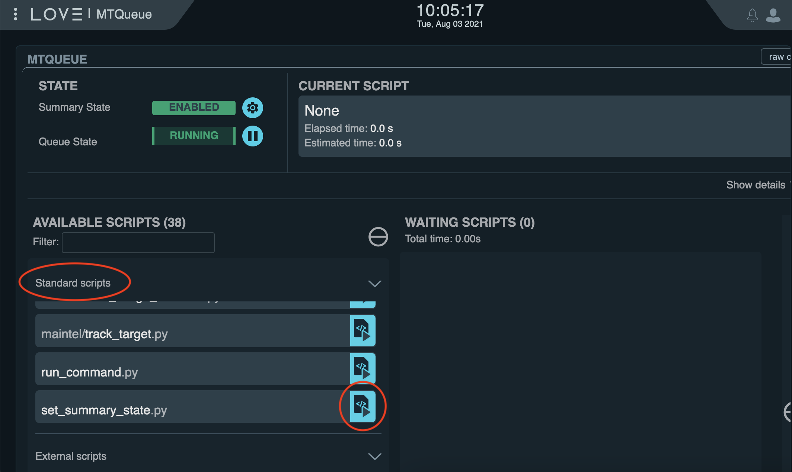
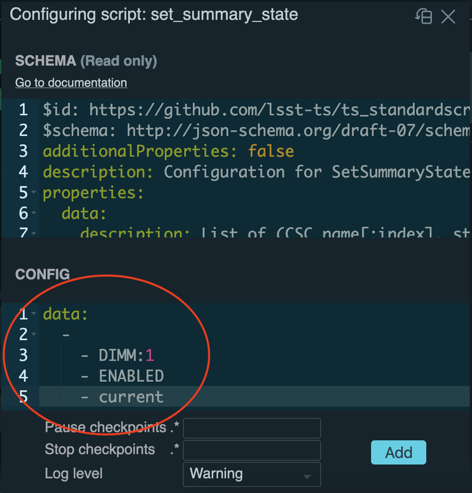
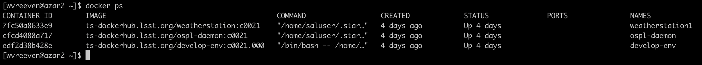
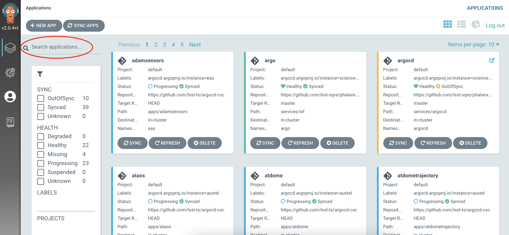
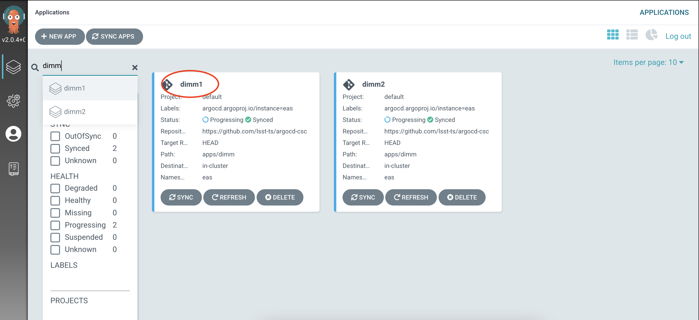
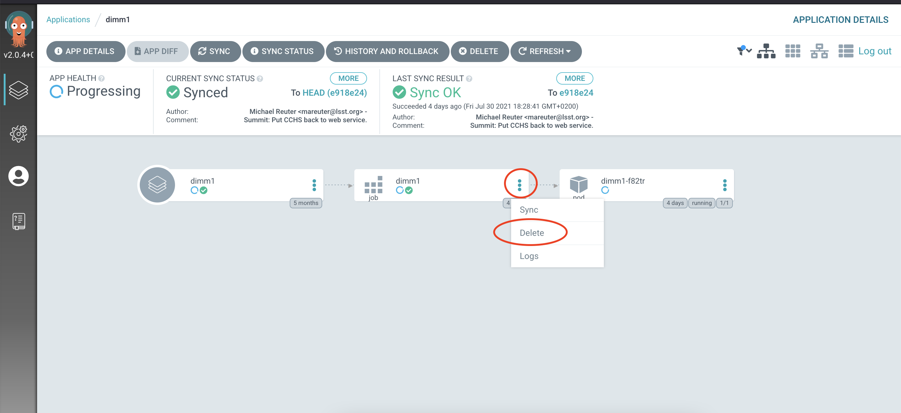
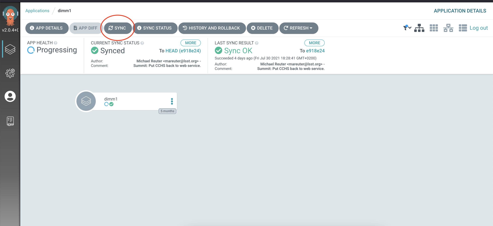

###########################
Testing A CSC At The Summit
###########################

Overview
^^^^^^^^

This document decribes how to test a CSC, that is still under development, at the summit.

Prerequisites
^^^^^^^^^^^^^

- Announcements are to be made in the summit-annouce Slack channel
- People who participate in testing or infrastructure support/development must be actively monitoring that channel
- All announcements for all work that may affect the summit DDS network or its infrastructure are required
- Access to LOVE is required as well as access to the azar2 node with Docker rights.
- If the CSC under test already is deployed at the summit, access to ArgoCD is required as well.

Post-Conditions
^^^^^^^^^^^^^^^

- The CSC under test has been tested and/or debugged.
- The CSC under test is not running anymore.
- If a CSC, that already was deployed at the summit, was stopped during this tutorial, it is started again.

Tutorial Steps
^^^^^^^^^^^^^^

Stopping the production CSC
---------------------------

The first thing to do, is to check and verify that the CSC under test currently is not running in the production environment at the summit.
To do so, login to LOVE and open the CSCSummary+CSCG view.
That view displays all deployed CSCs and informs about the statuses of the CSCs.
If the CSC, that you are going to test, is in STANDBY (S) or ENABLED (E) mode, you need to set it OFFLINE.
This can be done by returning to the main LOVE page and selecting the MTQueue or ATQueue, depending on which group the CSC belongs to.
From the list of Standard Scripts, select ``set_summary_state.py`` by clicking on the blue icon to the right of the script name.

In the popup, specify the configuration data for the script, for instance:

::

    data:
      -
        - DIMM:1
        - OFFLINE
        - current

would set the DIMM CSC with index 1 OFFLINE.

Connect to the deploy-env container
-----------------------------------

Once you are sure that the CSC you are going to work with is not running in the production environment (anymore), you can login via ssh to azar2.
To login to azar2, you can issue

::

    ssh azar2.cp.lsst.org

After logging in to azar2, the first thing to do is to check and verify that the develop container is running.
This can be done with

::

    docker ps

You should see at least two docker containers running.

One is the ``ts-dockerhub.lsst.org/develop-env`` container, the other the ``ts-dockerhub.lsst.org/ospl-daemon`` container.
If the ``ts-dockerhub.lsst.org/ospl-daemon`` container is not running, please contact Tiago Ribeiro.
If the ``ts-dockerhub.lsst.org/develop-env`` container is not running, it can be started by following these steps:

::

    source /deploy-lsstts/docker-compose-ops/summit/setup.env
    cd /deploy-lsstts/docker-compose-ops/summit/develop/
    docker-compose up -d develop-env

Once ``ts-dockerhub.lsst.org/develop-env`` container is running, you can connect to it with

::

    docker exec -it develop-env bash

The ``ts-dockerhub.lsst.org/develop-env`` container contains the most widely used TSSW projects.

Deploy and run the test CSC
---------------------------

What you need to do next depends on whether the CSC under test is one of those or not.
But before going there, first this.
It is hard to import code into the Docker container and developing code inside the container of course is not done.
So make sure to have a local ticket branch and to push all code changes to GitHub.
That way you can pull the changes using git into the container.

If your CSC is not part of the projects that come with the container, you need to pull it first and then switch to your ticket branch.
If it is part of the container, you can clone the repo into the ``repos`` directory after which you can switch to your ticket branch.
The same applies to any ``ts_config_xxx`` repo that your CSC uses.

Before starting the CSC, it is important to use the correct OSPL configuration file.
The preferred configuration file makes sure that shared memory is used.
To make sure to load that file you can issue

::

    source /home/saluser/.setup_dev.sh
    export OSPL_URI=$(python -c "from lsst.ts import ddsconfig; print( (ddsconfig.get_config_dir() / 'ospl-shmem.xml').as_uri())")

After that you can start your CSC with (taking the DIMM as an example again):

::

    cd repos/ts_dimm
    setup -r .
    ./bin/dimm_csc.py 1

Now you can use LOVE to set the CSC to enabled.
To do so, use the same configuration data for the ``set_summary_state.py`` script as before, but now using ENABLED instead of OFFLINE.
With your CSC running, you can return to the LOVE view that contains your CSC (ATQueue or MTQueue) and check the log messages produced by the CSC.
If you need to make code changes, simply use LOVE to set the CSC OFFLINE and then pull the code changes in the Docker container.
After that, you can start the CSC in the container again and set it to ENABLED in LOVE.
Repeat this until you are satisfied.
When you're done, set the CSC to OFFLINE again.

Restarting the production CSC
-----------------------------

If, at the start of this tutorial, you stopped a CSC that was deployed in production, you need to redeploy it.
This can be done via ArgoCD.

- Once logged in, you can search for your CSC in the upper left.

- Click on the CSC name in the app summary box containing your CSC.

- You should be taken to a new screen with three boxes connected by arrows:one box for the app, one for the job and one for the pod.
- Click the three dots on the right side of the job box (that is the center box) and click Delete.

- Then in the menu at the upper left, click on the SYNC box (the third box from the left).

- Once syncing has finished, the CSC is in STANDBY mode again.
