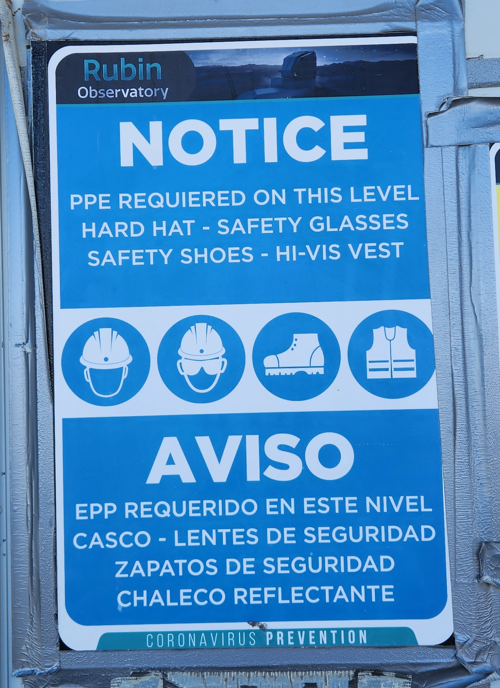
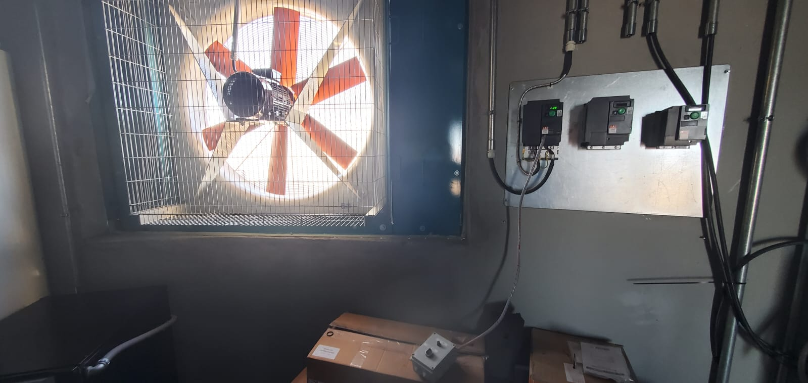

.. This is a template for an informative/general use document. 

.. Review the README in this document's directory on instructions to contribute.
.. Static objects, such as figures, should be stored in the _static directory. Review the _static/README in this procedure's directory on instructions to contribute.
.. Do not remove the comments that describe each section. They are included to provide guidance to contributors.
.. Do not remove other content provided in the templates, such as a section. Instead, comment out the content and include comments to explain the situation. For example:
	- If a section within the template is not needed, comment out the section title and label reference. Include a comment explaining why this is not required.
    - If a file cannot include a title (surrounded by ampersands (#)), comment out the title from the template and include a comment explaining why this is implemented (in addition to applying the ``title`` directive).

.. Include one Primary Author and list of Contributors (comma separated) between the asterisks (*):
.. |author| replace:: *Name-of-Primary-Author*
.. If there are no contributors, write "none" between the asterisks. Do not remove the substitution.
.. |contributors| replace:: *List-of-contributors*

.. This is the label that can be used as for cross referencing this procedure.
.. Recommended format is "Directory Name"-"Title Name"  -- Spaces should be replaced by hyphens.
.. _Safe-entry-to-AuxTel:
.. Each section should includes a label for cross referencing to a given area.
.. Recommended format for all labels is "Title Name"-"Section Name" -- Spaces should be replaced by hyphens.
.. To reference a label that isn't associated with an reST object such as a title or figure, you must include the link an explicit title using the syntax :ref:`link text <label-name>`.
.. An error will alert you of identical labels during the build process.

####################
Safe entry to AuxTel
####################

.. _Safe-entry-to-AuxTel-Overview:

Overview
========

This document aims to provide the necessary guidelines and procedures for safely entering AuxTel. 
It covers aspects related to access during nighttime operations, ventilation, calibrations, and daytime access. 
Ensure you follow these instructions to guarantee your safety and the safety of the equipment.

**Safety equipment for all entries**

Each entry to the telescope, regardless of the reason, must mandatorily use the following safety equipment:

- Helmet

- Reflective vest

- Safety shoes

    Safety Equipment

Please always keep the list of :ref:`emergency numbers <summit-contact-numbers-emergency-numbers>` handy for any emergencies.

.. _Safe-entry-to-AuxTel-access-during-daytime:

Access During Daytime
======================

The instructions for entering AuxTel during the day are described below.

1. **Conditional access**
   
   - Ensure that no images are being taken and no work is being done in the AT dome that might be disrupted upon entering the telescope.

.. _Safe-entry-to-AuxTel-access-during-ventilation:

Access During Ventilation
=========================

The procedures for entering AuxTel during ventilation periods are described below.

    Air extraction fan.

1. **Ventilation Notification**

   - Ventilation starts with a notification via Slack channels and/or radio channel 3.

2. **Safety Precautions**

   - Ensure the windows are fully open and the fan operates at 20%.

   - Take special care not to lean on the windows or manipulate the fan while it is running.

   - On the telescope's second floor, verify that the telescope is in a horizontal position and the dome is facing opposite the Sun to maximize the ventilation system.

3. **Emergency Procedures**

   - In case of emergency, notify immediately via radio channel

.. _Safe-entry-to-AuxTel-access-during-calibrations:

Access During Calibrations
==========================

.. warning::

    Access is **NOT** permitted during calibrations unless there is an issue with the system that requires attention, and images can be interrupted or are not currently being taken. 
    Ensure there are no announcements in Slack, and confirm with summit staff (daytime shift workers or an Observing Specialist) that no images are in progress.

.. _Safe-entry-to-AuxTel-access-during-night-time-operations:

Access During Night time Operations
==================================

Below are the guidelines for entering the AuxTel telescope during nighttime operations.

1. **Entry Permissions**

   - Only authorized personnel and the Observing Specialist team can enter without an external permit during operations.

2. **Entry door key**

   - The key to access the main entrance door to the telescope will be hanging on the right side of the door just below the fire extintor sign. It is strictly requested that the keys must be always left in the same place when leaving the telescope.

   .. figure:: ./_static/keys.png
       :name: keys
       :scale: 25 %

       Key hook

   .. note:: 
       Exceptionally, the entrance door will currently be left unlocked.

3. **Communication Protocols**
   
   - Announce your visit to the telescope indicating the reasons briefly via the Slack channels "Summit-auxtel" and "Summit-announce".

   - Communicate by radio on channel 3 when entering the telescope during the day and night. This action is suggested.

4. **Lighting Restrictions**
   
   .. warning:: 

    During operations, it is prohibited to turn on building lights when entering the telescope.

   .. caution:: 
        
    The use of flashlights or headlamp is permitted but they should point towards the ground and should be minimized to avoid interfering with observations.

   .. tip:: 

    Red flashlights are a good choice and they interfeer much less than regular white light.

.. _Safe-entry-to-AuxTel-behaviour-standards:

Behaviour Standards
====================

Maintain proper behavior at all times, including:

- Being close to a radio (or always carrying one) and communicating your intentions to summit staff and on Slack.
  
- Following the safety gate procedure.
  
- Locking out movement when necessary.

This procedure was last modified on |today|.