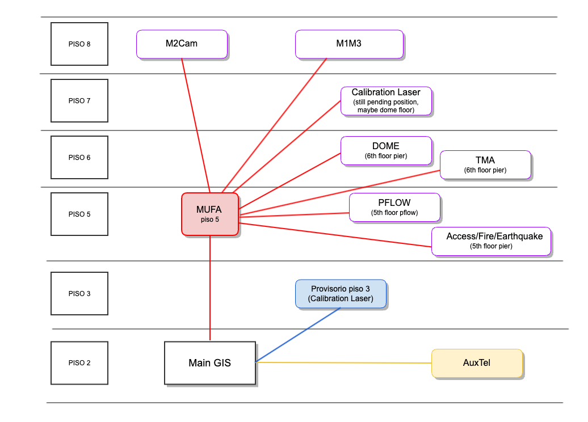
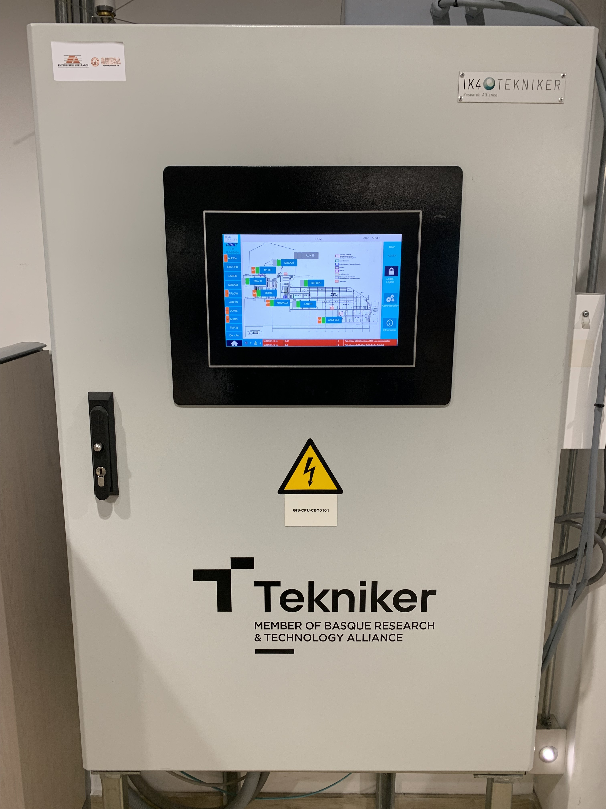
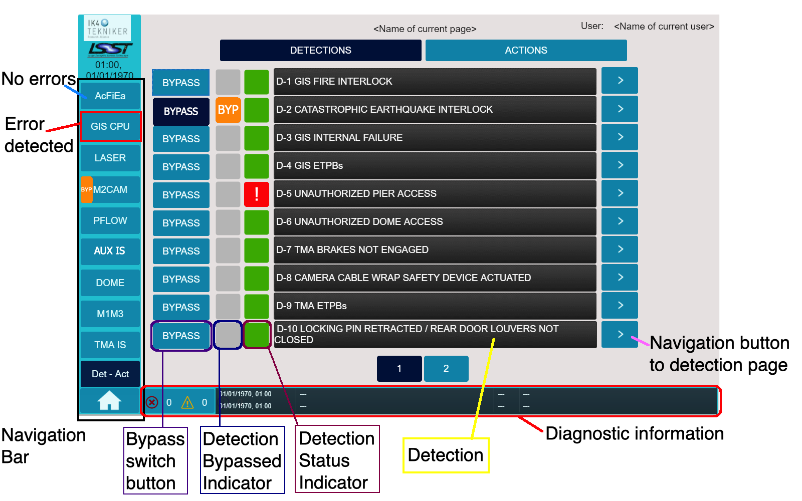

.. _Safety-Systems-GIS:

######################
GIS
######################

.. Include one Primary Author and list of Contributors (comma separated) between the asterisks (*):
.. |author| replace:: *Jacqueline Seron*
.. If there are no contributors, write "none" between the asterisks. Do not remove the substitution.
.. |contributors| replace:: *Franco Colleoni*

.. This is the label that can be used as for cross referencing this procedure.
.. Recommended format is "Directory Name"-"Title Name"  -- Spaces should be replaced by hyphens.
.. Each section should includes a label for cross referencing to a given area.
.. Recommended format for all labels is "Title Name"-"Section Name" -- Spaces should be replaced by hyphens.
.. To reference a label that isn't associated with an reST object such as a title or figure, you must include the link an explicit title using the syntax :ref:`link text <label-name>`.
.. An error will alert you of identical labels during the build process.

.. _Safety-Systems-GIS-Overview:

Overview
========

This document presents an introduction to the **General Interlock System (GIS)**, which plays a crucial 
role in ensuring safety and efficiency across various subsystems at Vera Rubin Observatory.

First, we provide an overview of the **structure** of the GIS, outlining its key components 
and how they interact to maintain operational integrity. 
Next, we explore the **safety matrix** of the GIS, detailing the various detections 
and corresponding actions taken to prevent hazardous scenarios. 
We describe **how users interact with the GIS**, including navigating the main controller interface 
and executing bypass and reset actions when necessary. 
Finally, we cover **troubleshooting** procedures to address any issues that may arise, 
ensuring smooth and uninterrupted operations.

.. maybe the troubleshooting section should be in another page?...

.. __Safety-Systems-GIS-General-Interlock-system:

General Interlock system
========================

The GIS is a critical system that communicates with various subsystems 
to prevent dangerous situations by managing interlocks amongst them. 

An **interlock** serves as a mechanism that prevents a system from proceeding 
unless specific conditions are met. 

Additionally, the implementation of **STO (Safe Torque Off)** further enhances safety 
by halting the power supply to the motor when required.

.. _Safety-Systems-GIS-Structure:

Structure
========================

The GIS is composed of a **Main Controller** (cabinet on level 2) and **several cabinets**. The Main Controller manages all other cabinets, and user interaction is primarily through the Main Controller interface. 

.. _Safety-Systems-GIS-connection-type:

.. admonition:: The connection to the subsystems is by: 

    * **Network**: TMA, Dome, M1M3, AuxTel.

    * **Signals wires**: Earthquake, Access control, Pflow lift, Calibration Laser, and the top-end subsystems (M2Cam, these are M2, M2Hex, Camera Rotator, Camera Hexapod).

TMA, M1M3 and Dome have their own Interlock system but they communicate to GIS. For instance, if a TMA interlock is triggered, you will see it in the GIS Main controller. 

.. note::
    Currently as of June 6 2024, Dome IS is connected to GIS, but the signals between both are bypassed, as integration tests between both systems are still pending.

.. Below the GIS design as of this date (March 29, 2024). 

.. This diagram was copied and updated based on Guido Maulen `Diseno GIS's page`_ and additions from Franco Colleoni.

.. _`Diseno GIS's page`: https://confluence.lsstcorp.org/display/IT/Diseno+GIS

      
      GIS Design updated on March 29, 2024

.. MUFA: Multiple-Use Fiber Access

.. _Safety-Systems-GIS-Safety-Matrix-Detections-and-Actions:

Safety Matrix. Detections and Actions
=======================================

The GIS uses a `safety matrix`_ to manage the interlocks, consisting of **Detections** signals 
and their corresponding **Actions** for the subsystems.

.. _`safety matrix`: https://github.com/lsst-ts/ts_tma_gis-documentation_user-interface-manual/blob/master/media/media/image50.png

.. admonition:: Detections

    Specific conditions or events within a subsystem.

.. admonition:: Action
    
    Response to the corresponding detection.

Certain Detections that could compromise the system's safety **trigger an interlock** mechanism, 
which is an Action taken to ensure safety.

Some Detections have Actions that only indicate their status, e.g. A fire interlock.

.. make the example more clear

.. list-table:: Examples
 :widths: 10 10 30
 :header-rows: 1

 * - Event
   - Detection
   - Action
 * - M1M3 mirror cell lights on
   - D-18 in GIS
   - TMA drives will be **STO (Safety Torque Off)** and engage the brakes.
 * -
   -
   -
 * - Big earthquake
   - D-2 in GIS
   - This will bring down most of the system. 
        Engage TMA brakes, discharge capacitor banks, and STO the following components: TMA drives, Camera Cable Wrap drives, M1M3 actuators, M2 hexapods, M2 actuators, Camera Rotator, Camera Hexapod, etc.

.. The page T&S Safety Interlocks - (Franco Colleoni) has a link to the “GIS Operation User manual”.  Is there a current version?. Will look for it. 
.. https://confluence.lsstcorp.org/pages/viewpage.action?pageId=16318660

.. _Safety-Systems-GIS-Interacting-with-GIS:

Interacting with GIS   
======================

.. _Safety-Systems-GIS-Main-Controller-Interface:

Main Controller Interface
------------------------------

      
      GIS Main Panel Cabinet at level 2

The Observing Specialists will interact with the Main Controller cabinet, located on Level 2.

Occasionally, in the event of system errors, interaction with other cabinets, for reboots or power cycling, may be necessary. However, such actions are likely beyond the scope of responsibilities for the OS team.

.. figure:: ./_static/GIS-Main-Panel-home.png
      :width: 700px
      
      GIS General Overview

The GIS General Overview (home), allows you to see the general status of the safety areas 
and select one in the navigation bar to the left.

Some area names are straightforward, while others are:

* **AcFiEa**: Access Control System / Fire Main Controller / Earthquake Control System. The safety gates to the pier intermediate level and to level 8 are referred as access control system.

* **M2CAM**: M2 area, includes the M2 actuator, the M2 hexapod, the Camera Hexapod and the Camera Rotator.

* **PFLOW/AUX**: Pflow Controller & Auxiliary Elements.

* **AUX IS**: Auxiliary Telescope Controller IS.

You can access the **GIS Detections and Actions** section with :guilabel:`Det-Act` button

      GIS Detections and actions

The status of the system is displayed, the symbols and their representation are: 

* BYP within an orange square: Indicates the action is bypassed. It logs alarms but doesn't trigger any action.

* Green square: Indicates an interlock not triggered.

* Red square: Indicates a triggered interlock.
 
    

.. admonition:: M2 changes in 2024

    * **Addition**: Signal **D-20** "M2 mirror in *closed-loop*" as a cause for the action **A-5** "Block TMA motion".

    * **Remove**: Signal **D-2** “Earthquake Alarm” from **A-13** “M2 STO” action signal.

.. _Safety-Systems-GIS-Main-Controller-Interface:

Bypass and reset actions
-------------------------

* Any user can :guilabel:`RESET` a subsystem.

* **Wired subsystems** are reset in GIS Main Panel. E.g M2 interlock can be reset in GIS.

* **Network based systems** reset on their own in GIS main panel after the reset in done in the specific subsytem. E.g. M1M3 interlock should be reset in M1M3 IS and then it will be clear in GIS main panel.

* Only admin user can bypass a subsystem.

* Detections can be bypassed but actions cannot.

* The D2 earthquake alarm may be bypassed at times, as it can cause the TMA to lose power if there are power or capacitor bank issues. (The acceleration threshold is approximately 0.3g, equivalent to a magnitude 5-6 earthquake).

.. note::
    
    D4 GIS E-stop: Safety gates E-stops are hit very often, so there were physically bypassed. This will be undone when operations start.

.. _Safety-Systems-GIS-Main-Controller-Interface:

Troubleshooting
================

In order to troubleshoot you need to understand the structure and check the alarm logs, at the bottom of the Main panel interface.

.. admonition:: Important

    Beware that sometimes the detection disappears, this means the interlocks are no longer triggered (because someone may have reset it) but the action is still in place.

.. _Safety-Systems-GIS-Dealing-with-interlocks-in-GIS-Main-Control-Panel:

Dealing with interlocks in GIS Main Control Panel
--------------------------------------------------

Remember, depending on the :ref:`connection type <Safety-Systems-GIS-connection-type>`

* **Wired subsystems** are :guilabel:`RESET` at the Main Control Panel.

* **Network-based systems** require resetting within their corresponding subsystem to clear the interlock in the Main Control panel.

.. _Safety-Systems-GIS-Top-end-system:

**Top End systems** (M2CAM), a special case
^^^^^^^^^^^^^^^^^^^^^^^^^^^^^^^^^^^^^^^^^^^^^^^^^^^^^^^^^^^^^^^

The status listed does NOT indicate the status of each individual element, but rather the **status of the E-Stop circuit** (including reset action) for each element.

After an **STO or power cycle** of the Top End systems, you must :guilabel:`RESET` the GIS E-stop status buttons before enabling the system from the corresponding interface. Even if the lights are green (indicating that the E-stop circuit is okay), the **reset action is still required**.

.. This maybe change to an autoreset action.

If another interlock triggered you need to follow the corresponding procedure to fix it, shown in table below. 

.. we may want to add links to the procedures.

.. list-table:: How to fix a triggered interlock
 :widths: 20 25 
 :header-rows: 1

 * - GIS signal
   - Do
 * - D2 Earthquake alarm
   - *Auto reset (when earthquake stop)*
 * - D3 GIS Internal failure
   - Power cycle GIS cabinet
 * - D4 GIS Estops
   - Reset triggered Estop at GIS panel
 * - D5 Unauthorized Pier access
   - Close 6th level safety gate
 * - D5 Unauthorized Dome access
   - Close 7th level safety gate (bypassed, July 2024)
 * - D7, D8, D9, D17 (TMA signals)
   - Reset at TMA EUI
 * - D10 to D13 (Dome signals)
   - Reset at Dome EUI
 * - D14 Camara Rotator Pin inserted
   - Reset at Camara Rotator EUI
 * - D15, D16 (Pflow signals)
   - *Auto reset (when lift position changes)*
 * - D18 M1M3 Interlock
   - Reset at M1M3IS
 * - D19 Man-lift parked
   - *Not currently used (July, 2024)*
 * - D20 M2 mirror in *closed-loop*
   - *Auto reset when M2 is in *closed-loop* again*

.. admonition:: Safety gates operation

    * To open a gate: Press :guilabel:`release` button (gate is open), then move the handle.
    * To close a gate: move the handle to close the gate. Press the :guilabel:`lock` button (the gate is closed).

.. admonition:: A note on M1M3 IS interface

    * Both detections and actions can be bypassed.
    * Any event (detection) will trigger the **GIS D18 "M1M3 interlock"**
    * When resetting an event, if it doesn't work press :guilabel:`RESET` twice.
    
    See more in `M1M3 Interlock System`_ page.

.. _`M1M3 Interlock System`: https://confluence.lsstcorp.org/display/LTS/M1M3+Interlock+System

.. is there a page in obs-ops

For more information visit the `GIS Tekniker page`_. 

.. _`GIS Tekniker page`: https://github.com/lsst-ts/ts_tma_gis-documentation_user-interface-manual

