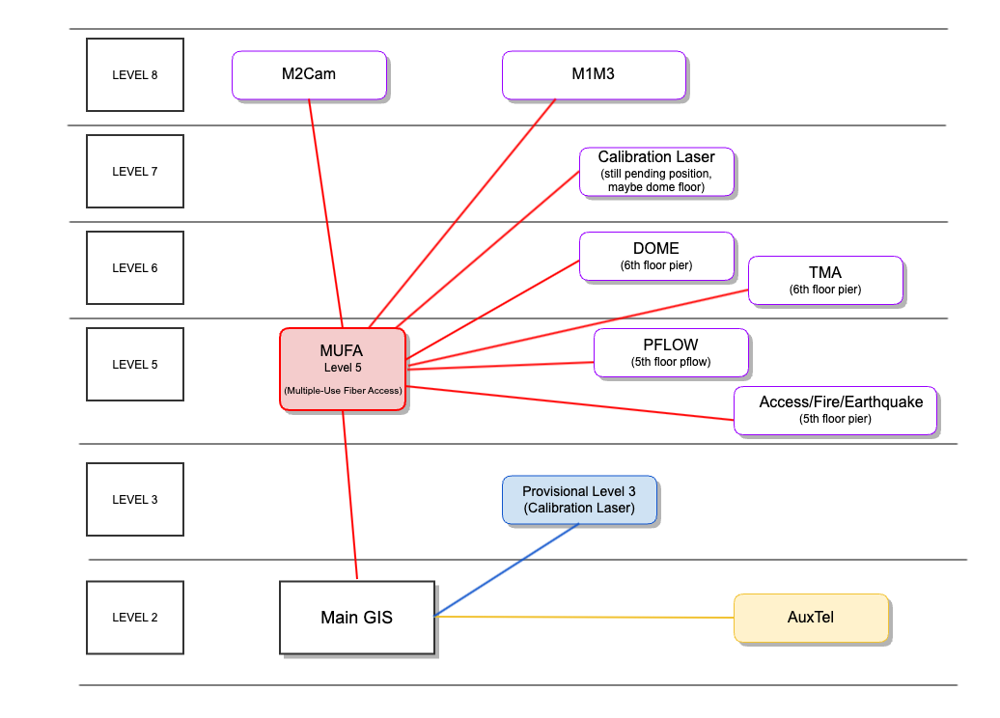

.. _Safety-Systems-GIS:

######################
GIS
######################

.. Include one Primary Author and list of Contributors (comma separated) between the asterisks (*):
.. |author| replace:: *Jacqueline Seron*
.. If there are no contributors, write "none" between the asterisks. Do not remove the substitution.
.. |contributors| replace:: *Franco Colleoni*

.. This is the label that can be used as for cross referencing this procedure.
.. Recommended format is "Directory Name"-"Title Name"  -- Spaces should be replaced by hyphens.
.. Each section should includes a label for cross referencing to a given area.
.. Recommended format for all labels is "Title Name"-"Section Name" -- Spaces should be replaced by hyphens.
.. To reference a label that isn't associated with an reST object such as a title or figure, you must include the link an explicit title using the syntax :ref:`link text <label-name>`.
.. An error will alert you of identical labels during the build process.

.. _Safety-Systems-GIS-Overview:

Overview
========

This document presents an introduction to the **General Interlock System (GIS)**, which plays a crucial 
role in ensuring safety and efficiency across various subsystems at Vera Rubin Observatory.

First, we provide an overview of the **structure** of the GIS, outlining its key components 
and how they interact to maintain operational integrity. 
Next, we explore the **safety matrix** of the GIS, detailing the various *detections* 
and corresponding *actions* taken to prevent hazardous scenarios. 
We describe **how users interact with the GIS**, including navigating the main controller interface 
and executing bypass and reset *actions* when necessary. 
Finally, we cover **troubleshooting** procedures to address any issues that may arise, 
ensuring smooth and uninterrupted operations.

.. maybe the troubleshooting section should be in another page?...

.. __Safety-Systems-GIS-General-Interlock-system:

General Interlock system
========================

The GIS is a critical system that communicates with various subsystems 
to prevent dangerous situations by managing interlocks amongst them. 

An **interlock** serves as a mechanism that prevents a system from proceeding 
unless specific conditions are met. 

Additionally, the implementation of **STO (Safe Torque Off)** further enhances safety 
by halting the power supply to the motor when required.

.. _Safety-Systems-GIS-Structure:

Structure
========================

The GIS is composed of a **Main Controller** 
(:ref:`cabinet on level 2 <Safety-Systems-GIS-Interacting-with-GIS-Main-Controller-Interface>`)
and **several cabinets**. 
The Main Controller manages all other cabinets, and user interaction is primarily through the Main Controller interface. 

.. _Safety-Systems-GIS-connection-type:

.. admonition:: The connection to the subsystems is by: 

    * **Network**: TMA, Dome, M1M3, AuxTel.

    * **Signals wires**: Earthquake, Access control, Pflow lift, Calibration Laser, and the top-end subsystems: M2Cam (that includes M2, M2 Hexapod, Camera Rotator, Camera Hexapod).

TMA, M1M3 and Dome have their own interlock system (IS) but they communicate to the GIS. 
For instance, if a TMA interlock is triggered, you will see it in the GIS Main controller. 

.. note::
    Currently as of June 6 2024, Dome IS is connected to GIS, but the signals between both are bypassed, as integration tests between both systems are still pending.

.. Below the GIS design as of this date (March 29, 2024). 

.. This diagram was copied and updated based on Guido Maulen `Diseno GIS's page`_ and additions from Franco Colleoni.

.. _`Diseno GIS's page`: https://confluence.lsstcorp.org/display/IT/Diseno+GIS

      
      GIS Design updated on June, 2024

.. MUFA: Multiple-Use Fiber Access

.. _Safety-Systems-GIS-Safety-Matrix-Detections-and-Actions:

Safety Matrix. Detections and Actions
=======================================

The GIS uses a `safety matrix`_ to manage the interlocks, consisting of *detections* signals 
and their corresponding *actions* for the subsystems.

.. _`safety matrix`: https://github.com/lsst-ts/ts_tma_gis-documentation_user-interface-manual/blob/master/media/media/image50.png

.. admonition:: Detection:

    Specific condition or event within a subsystem that is reported *to the GIS*.

.. admonition:: Action:
    
    Response to the corresponding *detection*, done *by the GIS*.

Certain *detections* that could compromise the system **trigger an interlock** mechanism, which is an *action* taken to ensure the system's safety.

Some *detections* have *actions* that only indicate their status, e.g. A fire interlock.

.. make the example more clear

.. list-table:: Examples
 :widths: 20 30
 :header-rows: 1

 * - *Detection*
   - *Action*
 * - M1M3 mirror cell lights on 
        (D-18 in GIS)

   - TMA drives will be **STO (Safety Torque Off)** and engage the brakes.
 * -
   -
 * - Big earthquake 
        (D-2 in GIS)
   - This will bring down most of the system. 
        Engage TMA brakes, discharge capacitor banks, and STO the following components: TMA drives, Camera Cable Wrap drives, M1M3 actuators, M2 Hexapods, M2 actuators, Camera Rotator, Camera Hexapod, etc.

.. The page T&S Safety Interlocks - (Franco Colleoni) has a link to the “GIS Operation User manual”.  Is there a current version?. Will look for it. 
.. https://confluence.lsstcorp.org/pages/viewpage.action?pageId=16318660

.. _Safety-Systems-GIS-Interacting-with-GIS:

Interacting with GIS   
======================

.. _Safety-Systems-GIS-Interacting-with-GIS-Main-Controller-Interface:

Main Controller Interface
------------------------------

      
      GIS Main Panel Cabinet at level 2

The Observing Specialists will interact with the Main Controller cabinet, located on Level 2.

Occasionally, in the event of system errors, 
it may be necessary to interact with other cabinets for reboots or power cycling. However, these activities are typically beyond the OS team's responsibilities.

.. figure:: ./_static/GIS-Main-Panel-home.png
      :width: 500px
      
      GIS General Overview

The *GIS General Overview* (home), allows you to see the general status of the safety areas. The navigation bar (left) allows you to navigate between the subsystems.

Some area names are straightforward, while others are:

* **AcFiEa**: Access Control System / Fire Main Controller / Earthquake Control System. The safety gates to the pier intermediate level and to level 8 are referred as access control system.

* **M2CAM**: M2 area, includes the M2 actuator, the M2 Hexapod, the Camera Hexapod and the Camera Rotator.

* **PFLOW/AUX**: Pflow Controller & Auxiliary Elements.

* **AUX IS**: Auxiliary Telescope Controller IS. It only has the *action* 'A-22 STO Earthquake Alarm'.

The **GIS Detections and Actions** window, accessed via the :guilabel:`Det-Act` button, 
displays all *detections* and *actions* across all systems, making it the most useful for monitoring.

.. figure:: ./_static/GIS-detections-actions.png
      :width: 700px

      GIS Detections and Actions window

The symbols and their representation are: 

* |byp-orange-square| : Indicates the *detection* is bypassed. It logs alarms but it doesn't trigger any *action*.

.. |byp-orange-square| image:: ./_static/BYP-orange-square.png
   :width: 1em
   :height: 1em
   :align: middle

* |red-square-excl| : Indicates a triggered interlock.

* |green-square| : Indicates no interlock is triggered for that *detection*.

 
    

.. admonition:: M2 changes in 2024

    * **Addition**: Signal **D-20** "M2 mirror in *closed-loop*" as a cause for the *action* **A-5** "Block TMA motion".

    * **Removal**: Signal **D-2** “Earthquake Alarm” from **A-13** “M2 STO” *action* signal.

.. _Safety-Systems-GIS-Main-Controller-Interface:

Bypass and reset *actions*
--------------------------

* Any user can reset a subsystem.

* **Wired subsystems** are reset in GIS Main Panel. 

  E.g Earthquake interlock is reset in the GIS (automatically when the detection dissapears).

* **Network based subsystems** reset on their own in GIS main panel, once the reset is done in the specific subsystem. 

  E.g. A M1M3 interlock should be reset in M1M3 IS and then it will be clear in GIS main panel.

* Only admin user can bypass a subsystem.

* *Detections* can be bypassed but *actions* cannot.

* The 'D2 earthquake alarm' may occasionally be bypassed to prevent the TMA from losing power during power or capacitor bank issues. The acceleration threshold for the alarm is approximately 0.3g, which corresponds to a magnitude 5-6 earthquake.

.. note::
    
    D4 GIS E-stop: Safety gate E-stops are frequently triggered, so they are currently physically bypassed. This bypass will be removed when operations begin.

    For more information about safety gates refer to the :ref:`Safety Gates operation <Safety-Systems-Safety-Gate-Procedures:>` page.

.. _Safety-Systems-GIS-Main-Controller-Interface:

Troubleshooting
================

To troubleshoot, in addition to understand the system's structure, you may need to check the alarm logs. 
Click at the bottom of the Main panel interface to access the Diagnostic Information section. 
From here you can access the *Actual Alarm* and the *Alarm Log* tabs.

.. admonition:: Important

    Be aware that sometimes the *detection* disappears, indicating that the interlock is no longer triggered (possibly because someone has reset it), but the *action* may still be active.

      GIS Actual Alarms and Alarm Log tabs.

Note that the time reported for the alarms is still inaccurate and remains a pending issue to be resolved.

.. _Safety-Systems-GIS-Troubleshooting-Interlocks-in-GIS-Main-Control-Panel:

Interlocks in GIS Main Control Panel
--------------------------------------------------

Remember, depending on the :ref:`connection type <Safety-Systems-GIS-connection-type>`

* **Wired subsystems** are :guilabel:`RESET` at the GIS Main Control Panel.

* **Network-based systems** require resetting within their corresponding subsystem to clear the interlock in the Main Control panel.

.. _Safety-Systems-GIS-Troubleshooting-Dealing-with-interlocks-in-GIS-Main-Control-Panel-Top-end-systems:

Top End systems
^^^^^^^^^^^^^^^^^

**Top End systems** (M2CAM), are a special case. 
The *M2CAM - Overview* does NOT indicate the status of each individual element, 
but rather the **status of the CIRCUIT** that manages the **E-stop/STO** 
for each component. 

.. admonition:: Important

    If one of the *Top End systems* goes to **FAULT** due to an interlock or after a **STO or power cycle**, to enable it you must :guilabel:`RESET` the GIS E-stop status buttons in *M2CAM - Overview*. 

    In this case, even if the lights are green (indicating the E-stop circuit is okay), the :guilabel:`RESET` **is still required**.

      
      GIS *M2CAM - Overview*. 
      
The status of CH1 and CH2 in all sytems only have a triggered interlock (indicated by |red-square-excl|), 
if the E-stop at their cabinet is activated. For M2CAM this cannot happen because it's disabled.

The *M2CAM - Actions* tab show the STO Action activation status.
|red-square-excl|: STO is active, while |green-square| STO in NOT active.

      
      GIS *M2CAM - Actions* tab shows M2 Actuators STO active.

As an example, to clear 'A-13 STO M2 Actuators' *action* in place (indicated by |red-square-excl|), go to *M2CAM - Overview* and press :guilabel:`RESET` under 'M2 Actuator' (refer to the 2 previous images). After this, the A-13 action status should turn inactive (|green-square|).

Note that when you press the :guilabel:`RESET` button in *M2CAM - Overview*,
the Reset status indicator will briefly change from gray to green with a cross. If you don't see this change, press the button again.

The *M2CAM - Detections* tab shows the signals: 'D-14 Camera rotator pin inserted' 
and 'D-20 M2 mirror in closed-loop'.

.. This may change to an autoreset action.

.. _Safety-Systems-GIS-Troubleshooting-Dealing-with-interlocks-in-GIS-Main-Control-Panel-Procedures-for-triggered-interlocks:

Triggered interlocks
^^^^^^^^^^^^^^^^^^^^^^^^^^^^^^^^^^^^^^
Some triggered interlocks have an automatic reset, 
while others may require your input. 
This is shown in the table below. 

.. we may want to add links to the procedures.

.. list-table:: 
 :widths: 20 25 
 :header-rows: 1

 * - GIS signal
   - You should:
 * - D2 Earthquake alarm
   - *Auto reset (when earthquake stop)*
 * - D3 GIS Internal failure
   - Power cycle GIS cabinet
 * - D4 GIS Estops
   - Reset triggered Estop at GIS panel
 * - D5 Unauthorized Pier access
   - Close 6th level safety gate
 * - D5 Unauthorized Dome access
   - Close 7th level safety gate (bypassed, July 2024)
 * - D7, D8, D9, D17 (TMA signals)
   - Reset at TMA EUI
 * - D10 to D13 (Dome signals)
   - Reset at Dome EUI
 * - D14 Camara Rotator Pin inserted
   - Reset at Camara Rotator EUI
 * - D15, D16 (Pflow signals)
   - *Auto reset (when lift position changes)*
 * - D18 M1M3 Interlock
   - Reset at M1M3 IS
 * - D19 Man-lift parked
   - *Not currently used (July, 2024)*
 * - D20 M2 mirror in *closed-loop*
   - Auto reset when M2 is in *closed-loop* again

.. admonition:: A note on M1M3 IS interface

    * Both *detections* and *actions* can be bypassed.
    * Any event (*detection*) will trigger the GIS 'D18 M1M3 interlock'.
    * When resetting an event, if it doesn't work press :guilabel:`RESET` twice.
    
    See more in `M1M3 Interlock System`_ page.

.. _`M1M3 Interlock System`: https://confluence.lsstcorp.org/display/LTS/M1M3+Interlock+System

.. When available add a link to the page for M1M3 IS  

For more information visit the `GIS Tekniker page`_. 

.. _`GIS Tekniker page`: https://github.com/lsst-ts/ts_tma_gis-documentation_user-interface-manual
