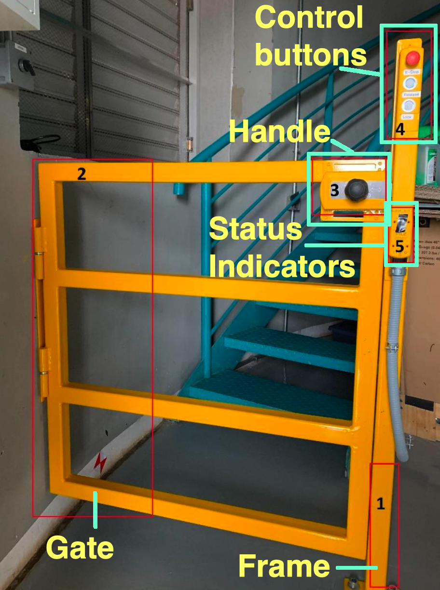
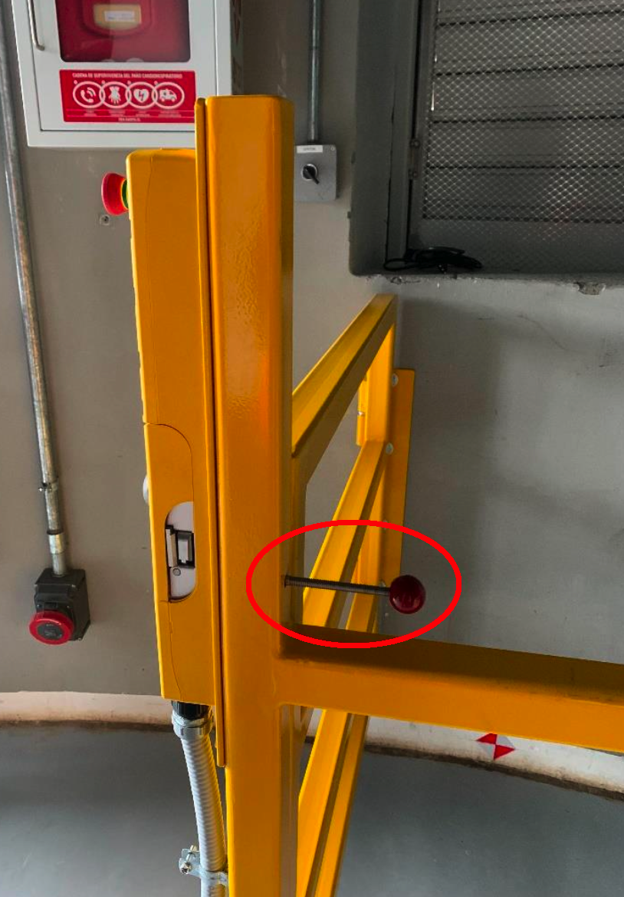
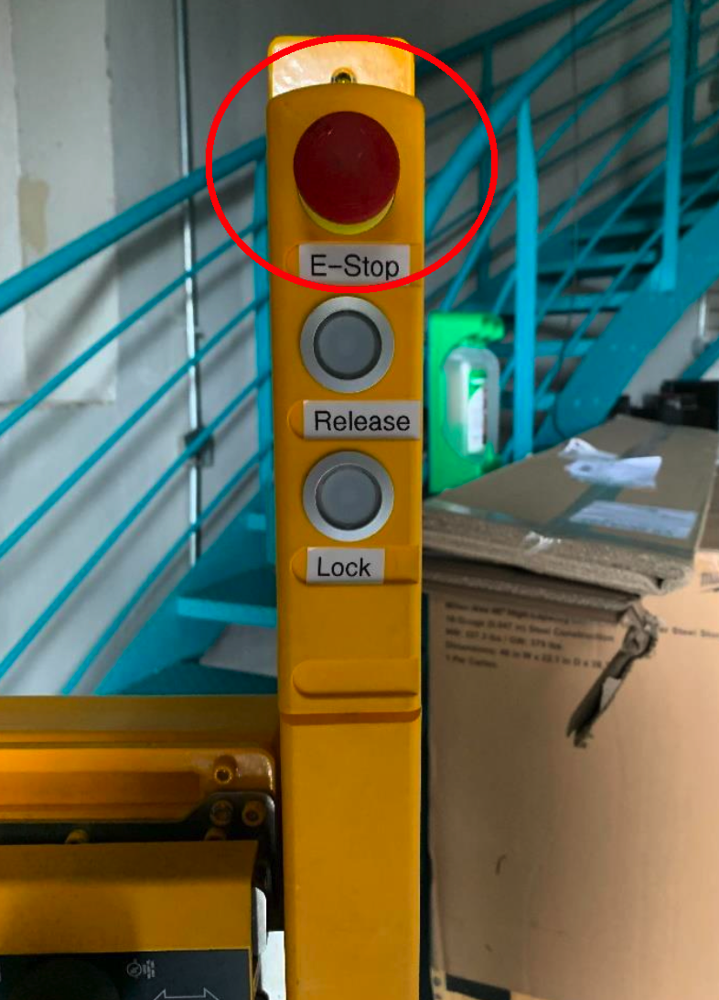
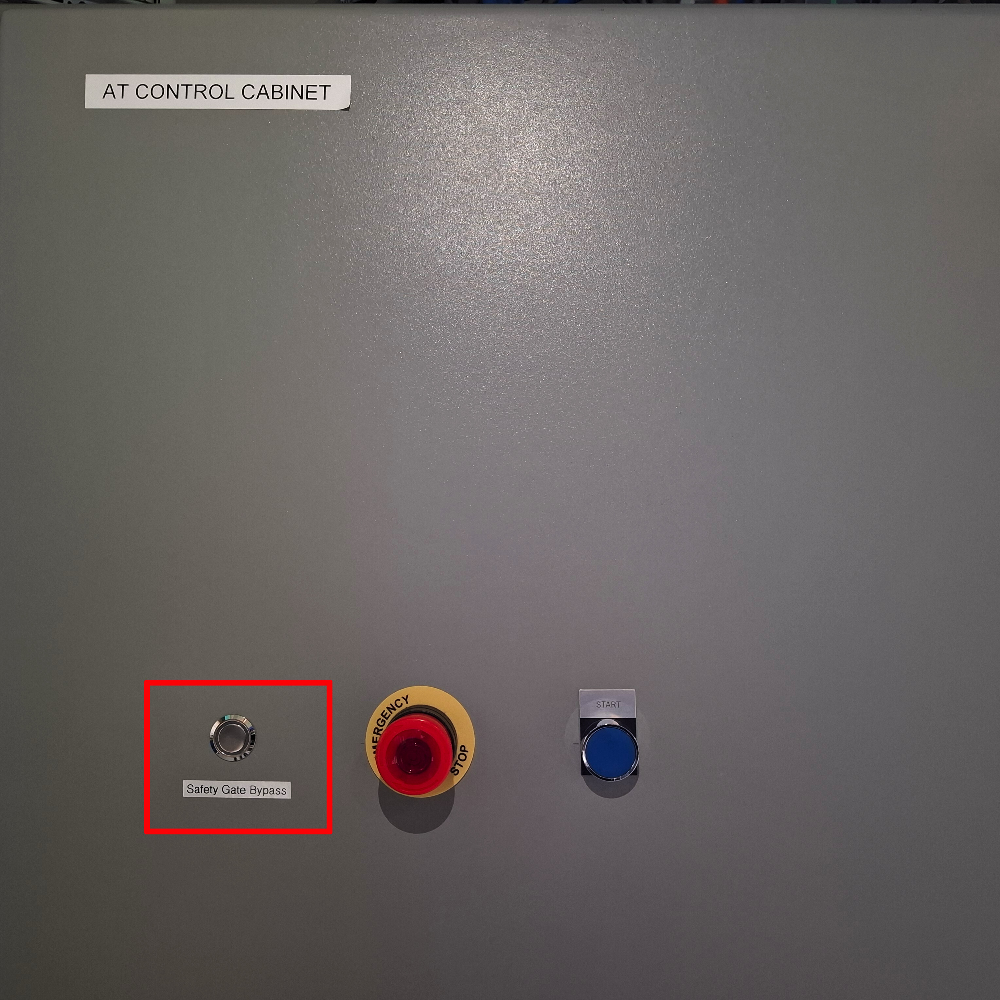
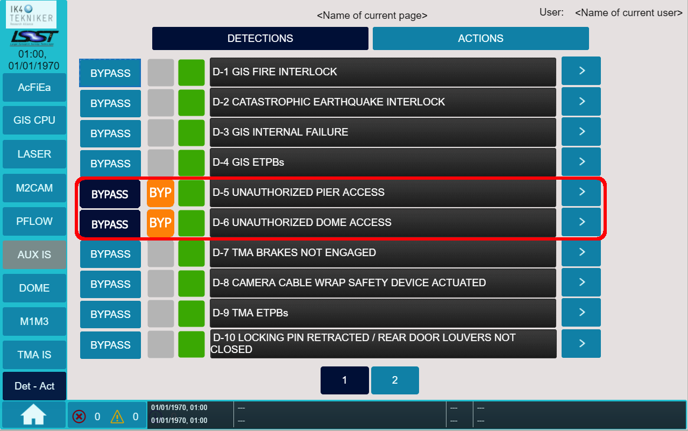

.. This is a template for an informative/general use document. 

.. Review the README in this document's directory on instructions to contribute.
.. Static objects, such as figures, should be stored in the _static directory. Review the _static/README in this procedure's directory on instructions to contribute.
.. Do not remove the comments that describe each section. They are included to provide guidance to contributors.
.. Do not remove other content provided in the templates, such as a section. Instead, comment out the content and include comments to explain the situation. For example:
	- If a section within the template is not needed, comment out the section title and label reference. Include a comment explaining why this is not required.
    - If a file cannot include a title (surrounded by ampersands (#)), comment out the title from the template and include a comment explaining why this is implemented (in addition to applying the ``title`` directive).

.. Include one Primary Author and list of Contributors (comma separated) between the asterisks (*):
.. |author| replace:: *Franco Colleoni, Jacqueline Seron*
.. If there are no contributors, write "none" between the asterisks. Do not remove the substitution.
.. |contributors| replace:: *none*

.. This is the label that can be used as for cross referencing this procedure.
.. Recommended format is "Directory Name"-"Title Name"  -- Spaces should be replaced by hyphens.
.. _Safety-Systems-Safety-Gate-Introduction:
.. Each section should includes a label for cross referencing to a given area.
.. Recommended format for all labels is "Title Name"-"Section Name" -- Spaces should be replaced by hyphens.
.. To reference a label that isn't associated with an reST object such as a title or figure, you must include the link an explicit title using the syntax :ref:`link text <label-name>`.
.. An error will alert you of identical labels during the build process.

################################
Safety Gate Introduction
################################

.. _Safety-Gate-Introduction-Overview:

Overview
=========

This document provides an introduction to the Safety gates used at the Vera C. Rubin Observatory, 
including its components, functional states, and the emergency safety mechanisms in place.

The **safety gate** is an electronic gateway designed to prevent access to 
hazardous areas. At the Rubin Observatory, these areas are near 
the telescope or dome while they are operational. 
The gate is controlled by the associated Interlock System (IS).

.. _Safety-Gate-Introduction-Safety-gates-at-the-Rubin-Observatory:

Safety gates at the Rubin Observatory
======================================

Simonyi telescope has 2 safety gates, while the AuxTel telescope has one. The table below shows some of their details.

=========================  =======================  =========================
|                          **AuxTel**               **Simonyi**
=========================  =======================  =========================
| Gate Location            Bottom of the stairs     | - Level 6
                                                    | - Level 7 
-------------------------  -----------------------  -------------------------
Protected area             | 2nd floor              | - Intermediate pier 
                                                    | - Level 8
-------------------------  -----------------------  -------------------------
Controlled by IS           AuxTel IS                GIS
-------------------------  -----------------------  -------------------------
Bypass/override button     Outside AuxTel Main      GIS Main Cabinet 
                           Cabinet
=========================  =======================  =========================

.. _Safety-Gate-Introduction-Components:

Components
============

The **main components** of the gate are:

#. **Frame**, the mechanical frame of the gate attached to the floor.
#. **Gate** can be opened and closed like a regular gate.
#. **Handle** used to physically open/close the gate, and to attach the gate to the frame.
#. **Control buttons** to open/close the gate electronically.
#. **Status Indicators** LEDs that indicate the gate status.

.. Fig2. Safety gate components.

      
      Safety gate components

.. _Safety-Gate-Introduction-Gate-Functional-States:

Gate Functional States 
===========================

.. - section 2

The gate has three functional states: 1: Open, 2: Closed, 3: Error.

.. _Safety-Gate-Introduction-Gate-Functional-States-Open:

Open
-----------

When the gate is open, its electronics send an **interlock signal** to the IS,
**disabling the drives** for the telescope and dome. 

Consequently, neither the telescope nor the dome can be operated with the gate open. 
This ensures that people working in the protected area are safe from unexpected movement.

.. _Safety-Gate-Introduction-Gate-Functional-States-Closed:

Closed
------------
When the gate is closed, its electronics **clear the interlock** to the IS, 
**enabling the drives** for the telescope and dome drives. 

A closed gate indicates that no one is beyond the gate, making it safe to allow movements.

.. warning::
    It is physically possible to go through the gate without opening it
    (by entering from the stairs side), but this violates safety protocols 
    and should **NOT** be done under normal circumstances.

.. _Safety-Gate-Introduction-Gate-Functional-States-Error:

Error
----------

In error mode **the gate cannot be locked again**. 
This usually occurs after the emergency release has been activated. 
This mechanism is described in the next section.

.. _Safety-Gate-Introduction-Emergency-safety-mechanisms:

Emergency safety mechanisms
================================== 

.. _Safety-Gate-Introduction-Emergency-safety-mechanisms-Emergency-release:

Emergency release 
---------------------
.. section 5

The gate has a **safety escape mechanism** located behind it, designed to disable the lock in case of emergency. 

This mechanism is designed for situations where people might need to be inside while the gate is locked. 
It is typically used in closed industrial areas, but this is less relevant for our situation.
Personnel should not be in proximity to the telescope or dome while they are in operations,
**except during engineering work**.

When the emergency release is pressed the gate enters an **Error state** and cannot be locked again. 
This is indicated by a red flashing light on the Status Indicators. 

.. Fig8. Emergency release mechanism

      
      Emergency release mechanism not activated

.. _Safety-Gate-Introduction-Emergency-safety-mechanisms-Gate-Emergency-Stop:

Gate Emergency Stop
---------------------

.. section 6

The gate E-STOP behaves the same way as other 
:ref:`E-STOP <Daytime-Operations-Safety-Control-Safety-Systems-Emergency-Stop>`. 

..  FIX THIS LINK!!! the labels in the page Control Safety systems have wrong labels 

.. Fig9. Emergency stop button

      
      Emergency stop button

.. _Safety-Gate-Introduction-Emergency-safety-mechanisms-Gate-Bypass-Override:

Gate Bypass/Override 
---------------------------
.. section 7

In exceptional cases where engineering work requires people to pass 
through the gate while the telescope/dome are enabled,
a bypass is available.

This override **disables the gate interlock**, 
allowing the gate to be opened or closed without triggering the interlock.

.. _Safety-Gate-Introduction-Emergency-safety-mechanisms-Gate-override-AuxTel-safety-gate-bypass:

AuxTel safety gate bypass
^^^^^^^^^^^^^^^^^^^^^^^^^^^^^

The location of the bypass/override button for AuxTel is on 1st floor, outside the Main cabinet.

      
      Safety gate bypass button in the AuxTel Main cabinet

.. note::
    The override button in AuxTel  will soon be replaced by an illuminated action button which will light up when override/bypass is active.

.. _Safety-Gate-Introduction-Emergency-safety-mechanisms-Gate-override-Simonyi-safety-gate-bypass:

Simonyi safety gate bypass
^^^^^^^^^^^^^^^^^^^^^^^^^^^^^

The bypass/override button for Simonyi is located in the GIS main cabinet on level 2,
within Detections and Actions window (Det-Act) under the signals:

* **D-5**: 'Unauthorized pier access'
* **D-6**: 'Unauthorized pier access'.

      
      Safety gate bypass button in the GIS Main cabinet

.. admonition::
    Important

    If the gate needs to be overridden, you must coordinate with users in the corresponding channel (`#summit_auxtel`_, `#summit_simonyi`_) and ensure that the system is returned to normal once the work is completed. 

For instructions on how to operate the gate go to the :ref:`Safety Gate procedures <Safety-Systems-Safety-Gate-Procedures>` page.

.. _#summit_auxtel: https://lsstc.slack.com/archives/C01K4M6R4AH
.. _#summit_simonyi: https://lsstc.slack.com/archives/C04HULH5HHD
