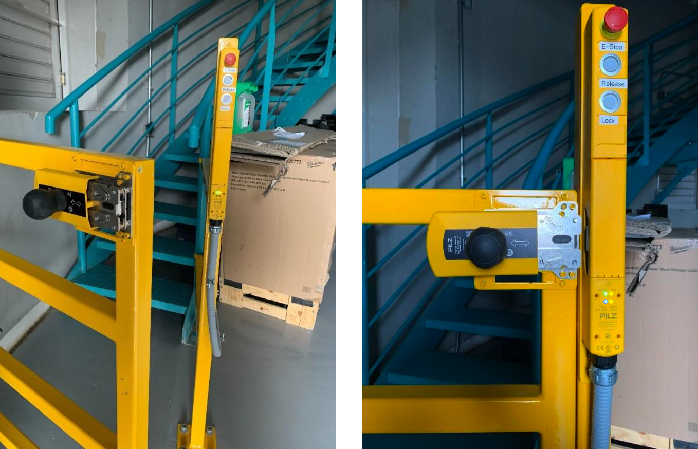
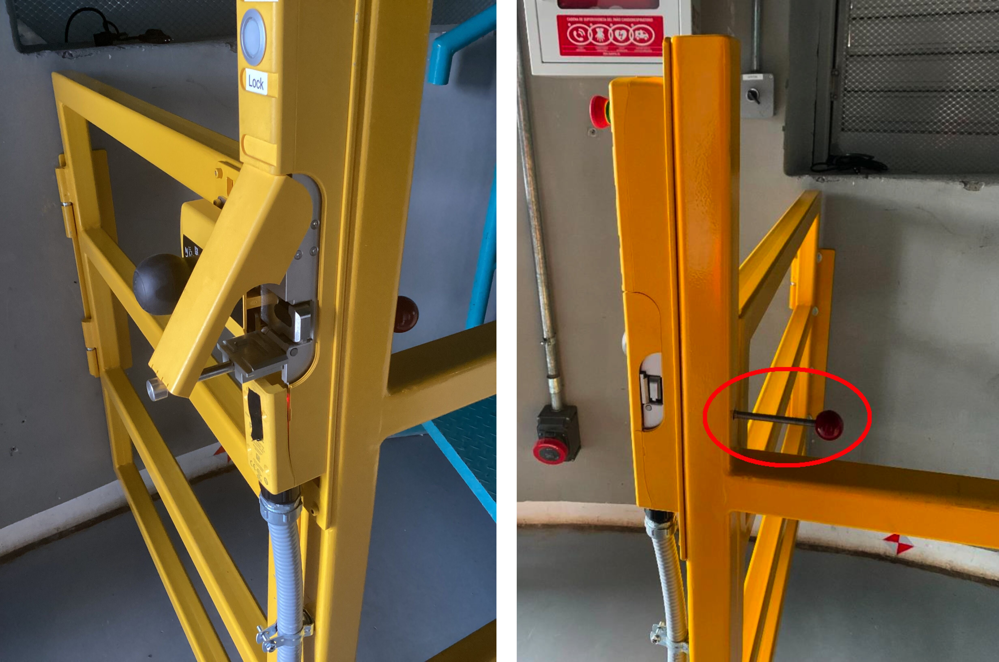

.. This is a template for an informative/general use document. 

.. Review the README in this document's directory on instructions to contribute.
.. Static objects, such as figures, should be stored in the _static directory. Review the _static/README in this procedure's directory on instructions to contribute.
.. Do not remove the comments that describe each section. They are included to provide guidance to contributors.
.. Do not remove other content provided in the templates, such as a section. Instead, comment out the content and include comments to explain the situation. For example:
	- If a section within the template is not needed, comment out the section title and label reference. Include a comment explaining why this is not required.
    - If a file cannot include a title (surrounded by ampersands (#)), comment out the title from the template and include a comment explaining why this is implemented (in addition to applying the ``title`` directive).

.. Include one Primary Author and list of Contributors (comma separated) between the asterisks (*):
.. |author| replace:: *Franco Colleoni, Jacqueline Seron*
.. If there are no contributors, write "none" between the asterisks. Do not remove the substitution.
.. |contributors| replace:: *none*

.. This is the label that can be used as for cross referencing this procedure.
.. Recommended format is "Directory Name"-"Title Name"  -- Spaces should be replaced by hyphens.
.. _Safety-Systems-Safety-Gate-Procedures:
.. Each section should includes a label for cross referencing to a given area.
.. Recommended format for all labels is "Title Name"-"Section Name" -- Spaces should be replaced by hyphens.
.. To reference a label that isn't associated with an reST object such as a title or figure, you must include the link an explicit title using the syntax :ref:`link text <label-name>`.
.. An error will alert you of identical labels during the build process.

###############################
Safety Gate Procedures
###############################

.. _Safety-Gate-Procedures-Overview:

Overview
========

.. This section should provide a brief, top-level description of the document's purpose and utilization. 

The safety gate is a safety mechanism that prevents telescope and dome movement 
when individuals pass through the gate.  
It is controlled by the Interlock System (IS) of each telescope.

This document outlines the following:

* **Gate operation**: opening and closing procedures, 

* **Recover the safety gate** in an Error state. 

For more information refer to the :ref:`Safety Gate Introduction <Safety-Systems-Safety-Gate-Introduction>`.

.. _Safety-Gate-Procedures-Gate-operation:

Gate operation
========================

Gate status:

* **Fully open**: :guilabel:`Release` pressed, handle removed, physically open.

* **Fully closed**: physically closed, handle inserted, and :guilabel:`Lock` pressed.

.. warning::
    If :guilabel:`Lock` is NOT pressed the IS will NOT register the gate as closed, even when is physically closed,
    and the telescope and dome drives will remain disabled. 

    If :guilabel:`Release` is pressed the IS will register the gate as open, even if the gate is physically closed.

.. Fig3. Gate fully opened 
.. Fig4. Gate in closed position

      
      Safety gate: fully opened (left), fully closed (right)

                                       
.. _Safety-Gate-Procedures-Gate-operation-Opening-the-gate:

Opening the gate 
------------------

.. - section 4

When the gate is fully closed, to open it:

1. Press the :guilabel:`Release` button on the gate. 
    The blue *Lock/Area Safe* indicator will turn off.

2. Move the **handle** to the left and physically move the gate to the open position.
    .. figure:: ./_static/lock-release-buttons.png
        :width: 250
        
        The :guilabel:`Release` and :guilabel:`Lock` buttons        
      

.. _Safety-Gate-Procedures-Gate-operation-Closing-the-gate:

Closing the gate
------------------
.. section 3

When the gate is fully open, to close it:

1. Move the gate to the **closed position**.

2. Insert the handle into the frame. 
    Notice that the *Safety Gate* indicator lights up.

    .. figure:: ./_static/handle-in-closed-position.png
      :width: 250px
      
      Handle in closed position

    .. Fig5. Handle in closed position

3. Press the :guilabel:`Lock` button. 
    You should hear a click, and the *Lock/Area Safe* indicator should illuminate in blue, signaling that the handle cannot be moved and the gate is securely closed. 

    .. Fig7. Locked gate indicator

    .. figure:: ./_static/locked-gate-indicator.png
        :width: 250px
        
        Locked gate indicator

.. _Safety-Gate-Procedures-Activate-Deactivate-bypass:

Activate/Deactivate safety gate bypass
========================================

Refer to the Safety Gate Intoduction page :ref:`Gate bypass section <Safety-Gate-Introduction-Emergency-safety-mechanisms-Gate-Bypass-Override>`.

* Bypass AuxTel safety gate:
    * To **activate**: press :guilabel:`Safety Gate Bypass`, it will stay pressed down after you release it. 
    * To **deactivate**: press :guilabel:`Safety Gate Bypass` again, and it will return to its original position.
* Bypass Simmonyi safety gate: 
    * To **activate**: go to GIS *Detections and Actions* window, and press the :guilabel:`BYPASS` switch for the corresponding safety gate detection (D-5 for level 6,  D-6 for level 7). The bypass indicator |byp-orange-square| will appear for that detection in the GIS.
    * To **deactivate**: press :guilabel:`BYPASS` again, and the GIS bypass indicator will dissapear.

.. |byp-orange-square| image:: ./_static/BYP-orange-square.png
   :width: 1em
   :height: 1em
   :align: middle

.. _Safety-Gate-Procedures-Enable-the-gate-after-emergency-release:

Enable the gate after emergency release
========================================

When the :ref:`emergency release mechanism is activated  <Safety-Gate-Introduction-Emergency-safety-mechanisms-Emergency-release>`, 
the gate enters the **error mode**. To recover it:

.. section 5

1. **Rearm the red handle** manually and move it to its normal position, as shown in figures below. 

2. Press the :guilabel:`Release` button for 5 seconds. 
    The Error mode will be reset, indicated by the red light disappearing.

.. Fig8 . Emergency release mechanism

      
      Emergency release mechanism.
      The left image shows the mechanism activated (red handle pressed), while the right image shows it in its normal position (inactive)

