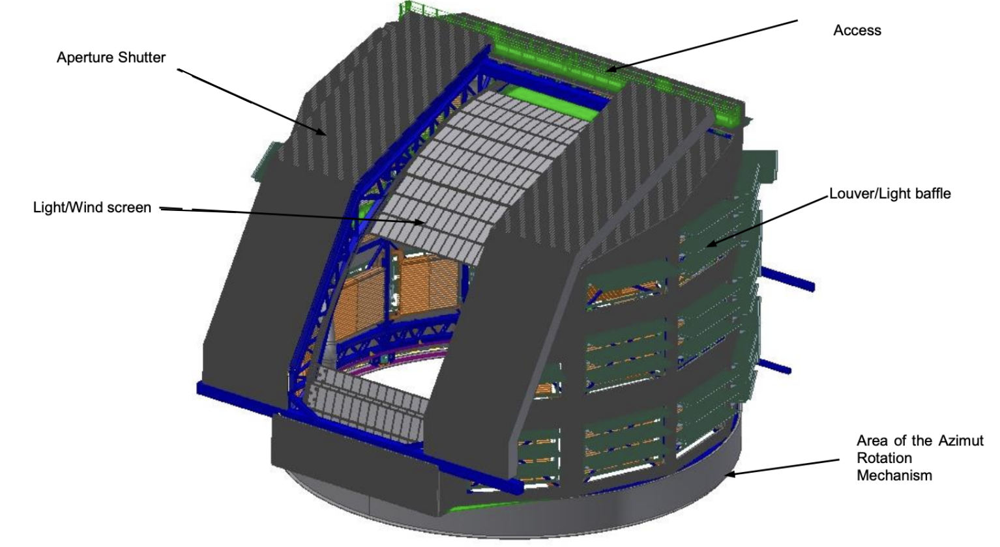

.. |author| replace:: *K.Peña*
.. If there are no contributors, write "none" between the asterisks. Do not remove the substitution.
.. |contributors| replace:: *W. van Reeven, K. Kelkar*

.. _`Simonyi Survey Telescope wavelength range`: https://www.lsst.org/sites/default/files/img/ugrizY.jpg 

.. _Simonyi-Components-MTDome:

######
MTDome
######

MTDome General description
==========================

The main purpose of the Simonyi Survey Telescope Dome (MTDome) is to protect the telescope from the environment. It must also:

* Provide a clear optical path for observing that can smoothly follow the motions of the telescope as it acquires and tracks fields on the sky.
* Minimize the effects of stray and scattered exterior light on the light level within the dome interior.
* Provide controlled ventilation and flushing of the dome interior with external ambient air during night operation to minimize the thermal effects on image quality.
* Facilitate maintenance of both the telescope and the Dome itself.
* Provide a controlled thermal environment during the day for preconditioning and testing.
* Be light-tight during the daytime to enable testing and calibration of the telescope’s optical system.
* Provide for in-situ repair and maintenance of Simonyi Survey Telescope key components.
As a result of its wide field of view the Simonyi Survey Telescope is very susceptible to stray light and requires a significant amount of optical baffling. The Dome constitutes one of stray light baffles of the overall Simonyi Survey Telescope system. The Dome enclosure is a cylindrical carousel with an aperture "biparting" shutter and light/wind screen function together to provide the stray light protection around the telescope line of sight by actively following the observing light path. The 34 vent openings with light baffling louvers have the contrasting requirements of simultaneously providing ample airflow and substantial scattered light attenuation. The rotation of the Dome is completely independent of the motion of the telescope although at comparable velocities (the dome maximum velocity is 0.6°/s).

MTDome Main Mechanical Components
=================================

* **Azimuth Drive and Bearing "Bogie" System (ADBS)**: This is the MTDome rotation mechanism. It has five motors spread evenly along the sides of the dome which imprint velocity, acceleration, and jerk values to the MTDome. The dome ADBS is fully automated via software. The encoder system allows the determination of absolute position and it is able to determine position through the entire range of motion. It has a locking pin system for mechanical interruption of movement.
* **Aperture shutter**: When fully open, the aperture shutter shall produce an 11.0 (+/-0.05) meter wide clear aperture continuous over the operational elevation range. The shutters have motorized locking mechanisms to restrain them in both the fully open and fully closed positions. The Aperture Shutter also has a locking pin system for mechanical interruption of movement.
* **Light/Wind screen**: This component provides a rectangular clear aperture of at least 11.0 meters in the horizontal direction and at least 10.0 meters in the elevation direction. Its drive motors utilize motorized braking when decelerating under normal operations.
* **Rear Access Doors**: These doors provide a clear dome access through a doorway which is capable of fully opening or fully closing in less than 90 seconds.
* **Louvered Light Baffling Vents**: Each louver have a motorized drive system which is capable of fully opening or fully closing the louver in less than 30 seconds, under :ref:`normal or marginal environmental conditions. <Observing-Constraints-Simonyi-Weather-Constraints>`

* **Overhead Bridge Crane and Trolley Cane**: These are the mobile structures attached to the MTDome; they ride on a pair of horizontal support beams that run along the sides of the aperture from the MTDome shutter to the rear access door.
* **Calibration Screen**: This is the major calibration component in the MTDome. It is a 10.4-meter diameter diffuse flat surface that is located on the dome interior. During operations, this screen is illuminated with both monochromatic and polychromatic light. The telescope is then pointed at the screen and images are acquired using the camera mounted on the telescope. These images can be used to determine the relative sensitivity of the telescope and camera system over the entire `Simonyi Survey Telescope wavelength range`_.

   
   Dome 3D view with Aperture Shutters open and Light/Wind screens open at El=20°.

Although not part of MTDome, the :ref:`Environmental Sensors Suite (ESS) <ESS-index>` keeps track of the environmental MTDome conditions. The MTDome also incorporates a high capacity HVAC system operated during the daytime to set the **internal dome temperature to -1C below the expected start of night temperature.**

MTDome CSCs
===========

The MTDome has a dedicated Commandable SAL Component (CSC). The capacitor banks telemetry is collected via MTDome CSC. *MTDomeTrajectory* is the CSC in charge of enabling the MTDome following.

MTDome Controller
=================

The Dome Control System (DCS) enable wireless communications. It is the interface to the facility lower enclosure which includes the azimuth bearing track, azimuth drive system, encoder system, slip ring and braking system. The Dome interfaces with the concrete lower enclosure through the azimuth support track, drive units, and slip rings. The MTDome CSC and GIS (Global Interlock System) communicate with the DCS (which also contains the DIS, Dome Interlock System) via ethernet. The fixed part of the DCS communicates with the rotating part of the DCS via WiFi. Currently, the MTDome Controller (DCS) is still under development.

The DCS includes the following software subsystems:

* *Azimuth Motion Control System (AMCS)* which rotates the dome.
* *Light and Wind Screen Control System (LWSCS)* which will move (up and down) the Light/Wind Screen once it has been installed and placed under software control.
* *Aperture Shutter Control System (ApSCS)* which opens and closes the Aperture Shutter.
* *Louvers Control System (LCS)* which opens and closes the louvers.
* *Thermal Control System (ThCS)* which is in charge of keeping the temperature of the azimuth drives and other components within requirements.

There are other software systems that the DCS reports the status for. They are called Control System to stay in line with the naming convention of the previous five but cannot be controlled via software. Those are:

    * *Capacitor Banks Control System (CBCS)* which monitors the status of the capacitor banks. There are Watcher rules in place that will raise alarms in case the CBCS reports alarming situations or in case the azimuth motion reports errors. More Watcher alarms will be added when more MTDome parts come under software control.
    * *Calibration Screen Control System (CSCS)* which monitors the status of the calibration screen hardware.
    * *Monitoring Control System (MonCS)* which reads and publishes the position and telemetry data from the crane, the pressure level of the inflatable seal, and monitors all interlock and safety statuses.
    * *Overhead Bridge Crane (OBC, Control System)*.
    * *Rear Access Door (RAD, Control System)*.

.. Procedures
.. ==========

.. .. _MTDome-Standard-Operations:
.. Standard Operations
.. ===================

.. Standard Procedures. Check that the following documents are included:
.. Start up:  BLOCK-244 Ready
.. Ending down: BLOCK-245 - MTDome Shutdown Ready
.. Dome handoff: Checkout and handoff MTDome
.. Dome shutter operations: Aperture Shutter Opening and Closing MTDome 
.. Slew dome to azimuth to an specific position: MTDome Standard Procedures
.. Enable/Disable dome following mode: MTDome Standard Procedures
.. Dome parking: MTDome Standard Procedures
.. Stopping dome motion and engage breaks: MTDome Standard Procedures
.. Clear fault in subsystems: MTDome Standard Procedures
.. Reset dome drives: MTDome Standard Procedures
.. Standard desired final status at the end of the night: MTDome & MTDomeTrajectory in STANDBY. 

.. .. _MTDome-Non-standard-Operations:
.. Non-standard Operations
.. =======================

.. Non-standard procedures. Check that the following documents are included:
.. Power-up MTDome 
.. Power-down MTDome
.. MTDome Shutter Emergency Shutdown
.. Emergency Stop and Recovery MTDome

.. .. _MTDome-Operations-Troubleshooting:
.. Troubleshooting
.. ===============

.. Troubleshooting. Check that the following documents are included:
.. MTDome Common Faults on Simonyi Common Faults
.. Problem with the Ethercat connection: MTDome cRIO restart
.. MTDome not aligned with TMA: MTDome re-home
.. MTDome not following: MTDome Recover and clear Faults
.. MTDome lost its zero value: MTDome Standard Procedures

