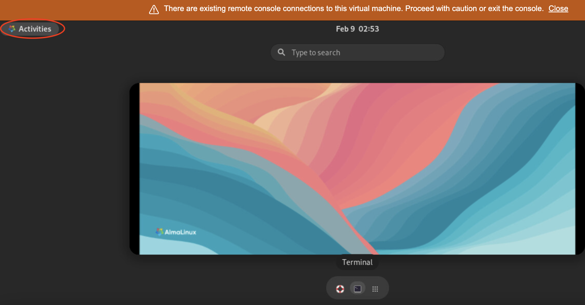
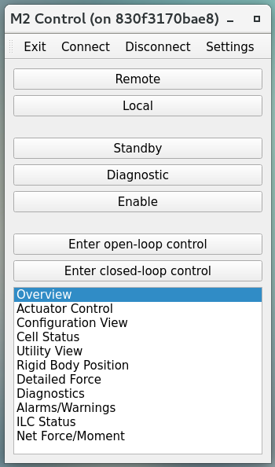
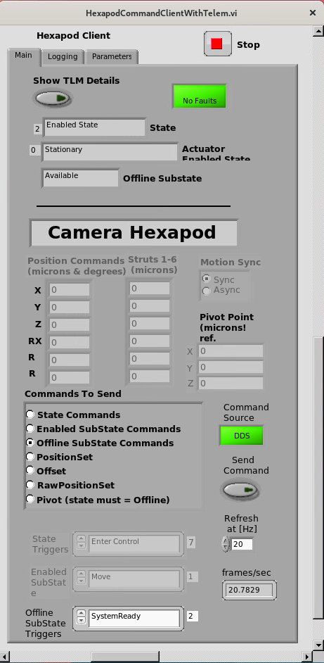
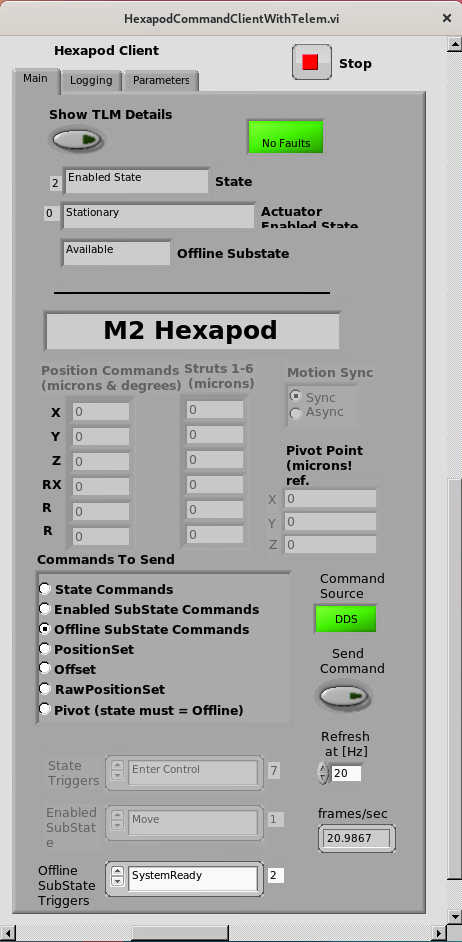

##############################
Accessing M2/Camera Hexapods and Camera Rotator EUIs
##############################

.. |author| replace:: *David Sanmartim, Yijung Kang, Alysha Shugart*
.. |contributors| replace:: *none*

.. _Accessing-M2-Camera-Hexapods-and-Camera-Rotator-EUIs-Overview:

Overview
========

This page describes how to access the M2/Camera Hexapods and Camera Rotator EUIs. The procedures are similar for all components as they reside on the same machine. This tutorial is intended for users who need to interact with these components and issue commands via the EUIs.

.. _Accessing-M2-Camera-Hexapods-and-Camera-Rotator-EUIs-Precondition:

Precondition
============

- Ensure you have an IPA account and credentials.
    - If you do not have access, create an IHS ticket in the JIRA IHS project to request access.
        - Select "Service request" under the issue type field.
        - Select "Account creation" under the component field.
        - Ask for your IPA credentials to be added to the list of users on the relevant virtual machine (Hexrot, m2, etc.).

.. _Accessing-M2-Camera-Hexapods-and-Camera-Rotator-EUIs-Post-Condition:

Post-Condition
==============

- The system will be connected to the EUI.
   - The EUI session should be properly closed after use.

.. _Accessing-M2-Camera-Hexapods-and-Camera-Rotator-EUIs-Tutorial-Steps:

Tutorial Steps
==============

#. Ensure you are safe using the M2/Camera Hexapods or Camera Rotator EUIs:

    - Verify the status of the systems by checking the relevant Slack channels:
       - ``#summit-announce``
       - ``#m2-worklog``
       - ``#hexrot-worklog``
       - ``#camhexrot_ccw``
  
    - Announce your intentions to use the EUIs in the relevant Slack channels.

    - Be mindful that another session may be open, and mouse motions or commands will come from another user.

#. Navigate to the virtual machine page: 
    - Go to ``https://vcenter.cp.lsst.org/`` or direct to ``https://hexrot-vm02.cp.lsst.org``.

#. Enter your IPA login credentials (username **without** @lsst.org).

    .. figure:: _static/vm.png
      :alt: VM Login
      :align: center

#. Navigate to Hexrot and click "launch web console".

    .. figure:: _static/vpcenter.png
      :alt: VM Machine
      :align: center
      
    .. figure:: _static/vpcenterVM.png
      :alt: VM Machine
      :align: center

#. Choose your account and use your IPA credentials again to enter the Hexrot VM.

    .. figure:: _static/log.png
      :alt: VM Login
      :align: center

#. Click "Activities" and open a terminal.

For MTM2 EUI:
-------------

.. prompt:: bash

 cd /rubin/mtm2/python
 ./run_m2gui

      
For Camera Hexapods EUI:
----------------------------

.. prompt:: bash

 cd /rubin/hexapod/build
 ./runCamHexEui

For M2 Hexapods EUI:
----------------------------

.. prompt:: bash

 cd /rubin/hexapod/build
 ./runM2HexEui

For Camera Rotator EUI:
-----------------------

.. prompt:: bash

 cd /rubin/rotator/build
 ./runRotEui

.. _Accessing-M2-Camera-Hexapods-and-Camera-Rotator-EUIs-Troubleshooting:

Troubleshooting
===============

- Before running the desired EUI, you can check if it is already running by executing one of the following commands on the terminal:
    - Check if CamHex EUI is running:
        - `ps -aux | grep runCamHex`
    - Check if M2Hex EUI is running:
        - `ps -aux | grep runM2Hex`
    - Check if runRotEui is running:
        - `ps -aux | grep runRotEui`
- If processes are already running, you may need to identify who is running them and ask permission to end one (or both) so you can run your own EUI session:
    - `sudo kill -9 {pid}`