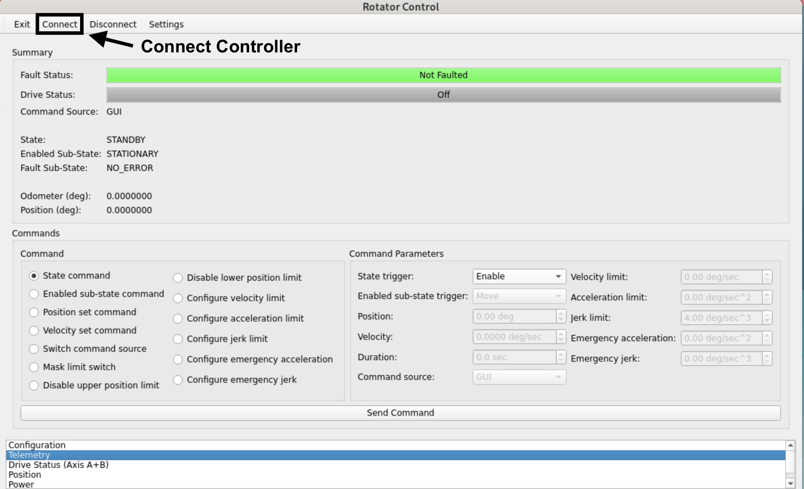

.. This is a template for an informative/general use document. 

.. Review the README in this document's directory on instructions to contribute.
.. Static objects, such as figures, should be stored in the _static directory. Review the _static/README in this procedure's directory on instructions to contribute.
.. Do not remove the comments that describe each section. They are included to provide guidance to contributors.
.. Do not remove other content provided in the templates, such as a section. Instead, comment out the content and include comments to explain the situation. For example:
	- If a section within the template is not needed, comment out the section title and label reference. Include a comment explaining why this is not required.
    - If a file cannot include a title (surrounded by ampersands (#)), comment out the title from the template and include a comment explaining why this is implemented (in addition to applying the ``title`` directive).

.. Include one Primary Author and list of Contributors (comma separated) between the asterisks (*):
.. |author| replace:: Yijung Kang
.. If there are no contributors, write "none" between the asterisks. Do not remove the substitution.
.. |contributors| replace:: Kshitija Kelkar, Kris Mortensen, Jacqueline Seron

.. This is the label that can be used as for cross referencing this procedure.
.. Recommended format is "Directory Name"-"Title Name"  -- Spaces should be replaced by hyphens.
.. _MTRot-Motion-Check:
.. Each section should includes a label for cross referencing to a given area.
.. Recommended format for all labels is "Title Name"-"Section Name" -- Spaces should be replaced by hyphens.
.. To reference a label that isn't associated with an reST object such as a title or figure, you must include the link an explicit title using the syntax :ref:`link text <label-name>`.
.. An error will alert you of identical labels during the build process.

######################
MTRotator Motion Check
######################

.. _MTRot-Motion-Check-Overview:

Overview
========

.. This section should provide a brief, top-level description of the document's purpose and utilization. 

This procedure checks the motion of the MTRotator under nominal movements, issued independently 
from the *LOVE/MTQueue* or the MTRotator EUI.

The most common occurrences that will require moving MTRotator directly are:

1. Resetting the rotator's position to avoid boundary limits while Simonyi is tracking.
2. Moving the rotator to 0 deg in preparation for a filter change/swap.
3. Realigning the rotator to the position of the Camera Cable Wrap (CCW).

.. warning::

    This check cannot be accomplished if the MTRotator CSC is in ``FAULT`` and/or with interlocks 
    activated on the :guilabel:`GIS` or the MTRotator EUI. Please refer to :ref:`MTRotator Recovery 
    Procedure <MTRotator-Recovery>` to clear these warnings before proceeding.    

.. _MTRotator-motion-check-script:

Using MTQueue & SAL Scripts
===========================

Run the :file:`maintel/mtrotator/move_rotator.py` SAL script on *LOVE/MTQueue* using the following configuration:

.. code-block:: python
    :caption: :file:`maintel/mtrotator/move_rotator.py`

    angle: <final_angle_in_degrees>
    # Final rotator angle in degrees.
    # Allowed range: [-90°, +90°].

.. admonition:: Changing Rotator Velocity
        :class: note

        Whenever the ``MTRotator`` CSC is newly enabled, the rotating velocity resets to its default value (3.5 deg/s). 
        If you need to move the Rotator with another velocity, issue a :code:`run_command.py` directly after enable the CSC. 
        The recommendation is 0.5 deg/s.

        .. code-block:: python
            :caption: :file:`maintel/run_command.py`
            
            component: MTRotator
            configureVelocity
            parameters:
                vlimit: 0.5

If this procedure fails, proceed to **using the MTRotator EUI**. 

.. _MTRotator-motion-check-eui:

Using the MTRotator EUI
=======================

1.  Enter the virtual machine that controls the rotator (*hexrot-vm01.cp.lsst.org*) with your IPA account credentials, and access the MTRotator GUI.

.. note::

    **Remote Access:**
    The :ref:`How to Access MT M2/Rotator/Hexapods/Dome EUI <Simonyi-Components-Simonyi-EUI-Access>` 
    has a detailed procedure for accessing all the GUIs in the virtual machine.

    **Summit Access:**
    If you are logged into a Linux machine at the summit, you can enter the virtual machine using an SSH command.

    * Open a terminal from the 'Activities' tab on top left, and type the following command::

        ssh -Y hexrot-vm01.cp.lsst.org
    

    MTRotator Python GUI (Controller Connected)

2.  Once in the *Rotator Control GUI*, :guilabel:`Connect` to the low-level controller (top-left), and change the ``Command Source`` to ``GUI``.

    a. In the ``Command`` section of the GUI, select :guilabel:`Switch command source`.
    
    b. Under the ``Command Parameters`` go to ``Command Source`` and select :guilabel:`GUI`.
    
    c. Execute the command by clicking :guilabel:`Send Command` at the bottom of the GUI.
      

3.  Check the rotator has to following configuration in the ``Summary`` section of the GUI::

        State: ENABLED
        Enabled Sub-State: STATIONARY
        Fault Sub-State: NO_ERROR

    If the ``State`` is in ``Standby``, you can enable the rotator as follows:

    a. Select :guilabel:`State command` under the ``Command`` section.
            
    b. Go to ``Command Parameters``, and under ``State trigger`` select :guilabel:`Enable`.
            
    c. Execute the command by clicking :guilabel:`Send Command`.
    
4.  To move the MTRotator using the GUI:

    a.  Choose a final position for the rotator:
    
        * Select :guilabel:`Position set command` in the ``Command`` section.
        * Under ``Command Parameters``, navigate to ``Position`` and input a value between **+/- 90 degrees**. 
        * Execute the command by clicking the :guilabel:`Send Command` button.

    .. figure:: ../_static/Rotator_Cmd30.png

    b.  Command the rotator to move to final position:
    
        * Select :guilabel:`Enabled sub-state command` in the ``Command`` section.
        * Under ``Command Parameters``, navigate to ``Enabled sub-state trigger`` and select :guilabel:`Move`. 
        * Execute the command by clicking the :guilabel:`Send Command` button.

    .. figure:: ../_static/Rotator_Move30.png

    c. Verify that the rotator is at commanded value by checking the ``Position`` under ``Summary``.

    .. figure:: ../_static/Rotator_Telemetry30.png

5.  If the MTRotator does not follow:

    a.  Transition to ``Standby`` state (step 3) followed by the ``Enabled`` state again to reset the internal 
        calculation of Simulink model. Then, move the rotator (step 4) to the specified position again.

    b.  It might also be possible that some internal signals are not triggered in Simulink module. 
        You can try moving the rotator a smaller distance, first (1 or 2 degrees away from its current position). If the 
        MTRotator moves then you could move it to the specified position.

.. warning::
    MTRotator position should always be at 0 degrees in the ``Standby`` state.

6. Once you are done moving the rotator, change the ``Command Source`` back to ``CSC`` 
   (step 2); then :guilabel:`Disconnect` from the controller and :guilabel:`Exit` the GUI.

This procedure was last modified on |today|.
