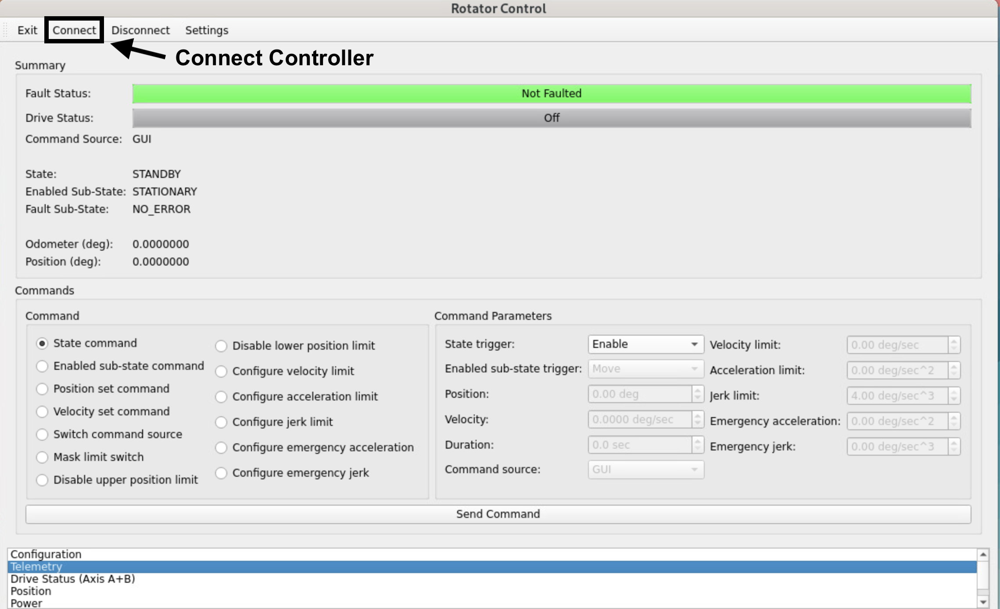

.. This is a template for an informative/general use document. 

.. Review the README in this document's directory on instructions to contribute.
.. Static objects, such as figures, should be stored in the _static directory. Review the _static/README in this procedure's directory on instructions to contribute.
.. Do not remove the comments that describe each section. They are included to provide guidance to contributors.
.. Do not remove other content provided in the templates, such as a section. Instead, comment out the content and include comments to explain the situation. For example:
	- If a section within the template is not needed, comment out the section title and label reference. Include a comment explaining why this is not required.
    - If a file cannot include a title (surrounded by ampersands (#)), comment out the title from the template and include a comment explaining why this is implemented (in addition to applying the ``title`` directive).

.. Include one Primary Author and list of Contributors (comma separated) between the asterisks (*):
.. |author| replace:: Yijung Kang
.. If there are no contributors, write "none" between the asterisks. Do not remove the substitution.
.. |contributors| replace:: Kshitija Kelkar, Kris Mortensen

.. This is the label that can be used as for cross referencing this procedure.
.. Recommended format is "Directory Name"-"Title Name"  -- Spaces should be replaced by hyphens.
.. _MTRot-Motion-Check:
.. Each section should includes a label for cross referencing to a given area.
.. Recommended format for all labels is "Title Name"-"Section Name" -- Spaces should be replaced by hyphens.
.. To reference a label that isn't associated with an reST object such as a title or figure, you must include the link an explicit title using the syntax :ref:`link text <label-name>`.
.. An error will alert you of identical labels during the build process.

######################
MTRotator Motion Check
######################

.. _MTRot-Motion-Check-Overview:

Overview
========

.. This section should provide a brief, top-level description of the document's purpose and utilization. 

This procedure checks the motion of the MTRotator under nominal movements, issued independently 
from the *LOVE/MTQueue* or the MTRotator EUI. 

.. warning::

    This check cannot be accomplished if MTRotator is in ``FAULT`` on the CSC and/or with interlocks 
    activated on the :guilabel:`GIS` or the MTRotator EUI. Please refer to :ref:`MTRotator Recovery 
    Procedure <MTRotator-Recovery>` to clear these warnings before proceeding.    

.. _MTRotator-motion-check-script:

Using MTQueue & SAL Scripts
===========================

Run the :file:`maintel/mtrotator/move_rotator.py` SAL script on *LOVE/MTQueue* using the following configuration:

.. code-block:: python
    :caption: :file:`maintel/mtrotator/move_rotator.py`

    angle: <final_angle_in_degrees>
    # Final rotator angle in degrees.
    # Allowed range: [-90°, +90°].

If this procedure fails, proceed to **using the MTRotator EUI**. 

.. _MTRotator-motion-check-eui:

Using the MTRotator EUI
=======================

1.  Enter the virtual machine that controls the rotator (*hexrot-vm01.cp.lsst.org*) with your IPA account credentials, and access the MTRotator GUI.
    
    a. The `How to Access MT M2/Rotator/Hexapods/Dome EUI <https://rubinobs.atlassian.net/wiki/spaces/OOD/pages/39685455/How+to+Access+MT+M2+Rotator+Hexapods+Dome+EUI>`_ 
    has a detailed procedure for accessing all the GUIs in the virtual machine.

.. note::

    If you are logged into a linux machine at the summit, you can enter the virtual machine using an SSH command.

    * Open a terminal from the 'Activities' tab on top left, and type the following command:

    .. code-block:: bash

        ssh -Y hexrot-vm01.cp.lsst.org
    

    MTRotator Python GUI (Controller Connected)

1.  Once in the *Rotator Control GUI*, :guilabel:`Connect` to the low-level controller (top-left), 
and change the ``Command Source`` to ``GUI``.

   a. In the ``Command`` section of the GUI, select :guilabel:`Switch command source`.

   b. Under the ``Command Parameters`` go to ``Command Source`` and select :guilabel:`GUI`.

1.  In the ``Summary`` section of the GUI, verify the following conditions for the rotator are met:

.. code-block:: text

    State: ENABLED
    Enabled Sub-State: STATIONARY
    Fault Sub-State: NO_ERROR
    
1.  To move the MTRotator, go to the :guilabel:`Commands to Send` 
    section and in :guilabel:`Enabled Substate Triggers`, 
    choose ``Move``. Then, input ``0`` degrees in the :guilabel:`Position Cmd` field and 
    execute the movement by clicking on the :guilabel:`Send Command` button.

2.  If the MTRotator does not follow:

    a.  Transition to ``Standby`` state followed by the ``Enabled`` state again to reset the internal 
        calculation of Simulink model. Then, do the p2p movement to origin again.

    b.  It might also be possible that some internal signals are not triggered in Simulink module. 
        You can try to do the p2p movement to another point such as 1 or 2 degree position first. If the 
        MTRotator moves then you could move it back to the origin.

.. note::
    
    If you want to p2p move the rotator after the soak test, consider the following steps:

    a.  Issue a :guilabel:`Stop` command to MTRotator and wait for 5 min. This should make sure the internal queue of *track* commands from the soak test has been processed 
        by Simulink model totally.

        .. figure:: /Simonyi/Non-Standard-Operations/_static/MTRot-motion-check-1.png
            :name: MTRot-motion-check-1
            :scale: 40%

    b.  Check the controller :guilabel:`State` is ``Enabled State`` and the :guilabel:`Actuator Enabled Sub-Sate` is ``Stationary``.

        .. figure:: /Simonyi/Non-Standard-Operations/_static/MTRot-motion-check-2.png
            :name: MTRot-motion-check-2
            :scale: 50%

 
.. warning::
    MTRotator position should always be at 0 degrees in the ``Standby`` state.  

This procedure was last modified on |today|.