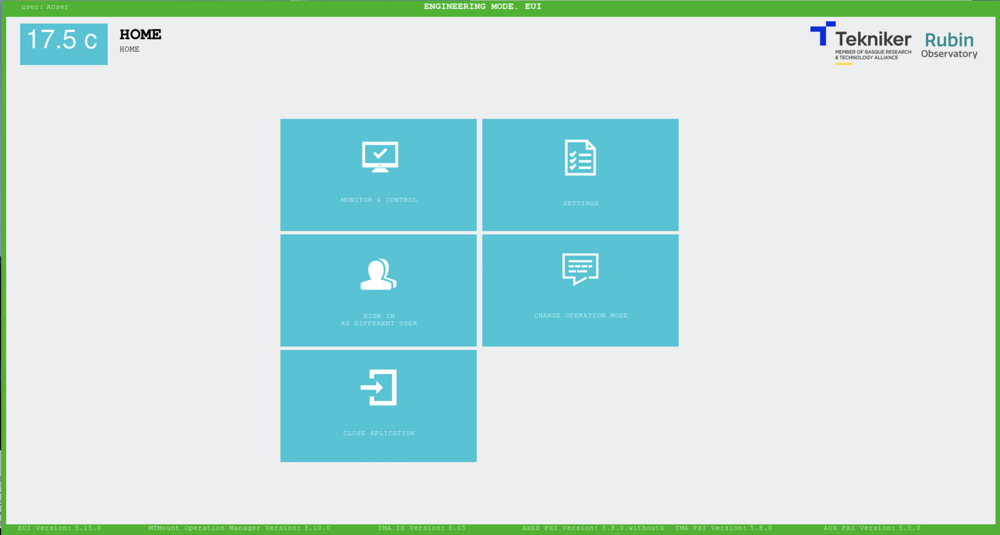

.. This is a template for troubleshooting when some part of the observatory enters an abnormal state. This comment may be deleted when the template is copied to the destination.

.. Review the README in this procedure's directory on instructions to contribute.
.. Static objects, such as figures, should be stored in the _static directory. Review the _static/README in this procedure's directory on instructions to contribute.
.. Do not remove the comments that describe each section. They are included to provide guidance to contributors.
.. Do not remove other content provided in the templates, such as a section. Instead, comment out the content and include comments to explain the situation. For example:
	- If a section within the template is not needed, comment out the section title and label reference. Include a comment explaining why this is not required.
    - If a file cannot include a title (surrounded by ampersands (#)), comment out the title from the template and include a comment explaining why this is implemented (in addition to applying the ``title`` directive).

.. Include one Primary Author and list of Contributors (comma separated) between the asterisks (*):
.. |author| replace:: *David Sanmartim*
.. If there are no contributors, write "none" between the asterisks. Do not remove the substitution.
.. |contributors| replace:: *Gonzalo Aravena*, *Paulina Venegas*

.. This is the label that can be used as for cross referencing this procedure.
.. Recommended format is "Directory Name"-"Title Name"  -- Spaces should be replaced by hyphens.
.. _TMA-Non-Standard-Procedures-Restart-MTMount-Operation-Manager:
.. Each section should includes a label for cross referencing to a given area.
.. Recommended format for all labels is "Title Name"-"Section Name" -- Spaces should be replaced by hyphens.
.. To reference a label that isn't associated with an reST object such as a title or figure, you must include the link an explicit title using the syntax :ref:`link text <label-name>`.
.. An error will alert you of identical labels during the build process.

############################################
TMA Restart MTMount Operation Manager (OM)
############################################

.. _TMA-Restart-MTMount-Operation-Manager-Overview:

Overview
========

This document outlines the procedure to restart the MTMount Operation Manager (OM). 
Restarting the OM may be necessary for troubleshooting or maintenance purposes. 
The OM is responsible for managing various operations related to the telescope mount. 

.. _TMA-Restart-MTMount-Operation-Manager-Steps:

Procedure Steps
===============

The procedure involves closing the EUI, assessing the status of the OM, stopping it, restarting it, and then reopening the EUI. 
It is not necessary to turn off OSS or PS.

.. _TMA-Restart-MTMount-Operation-Manager-Critical-Step-1:

1. **Close the EUI Application**: Close the EUI application ( :guilabel:`HOME` -> :guilabel:`Close Application`). 
   Allow some time for the application to close properly before proceeding to the next step. 
   It may take a while. 

    Screenshot of Simonyi EUI Home interface.

If EUI has become unresponsive, run :command:`top` and monitor the %CPU usage for the :command:`tma_eui`. 
If the CPU is actively processing, be patient and continue to wait. 
If it takes too long (e.g. 10 min or more), kill the process. 
To do this, follow these steps in the TMA computer's terminal:

.. prompt:: bash

 ps -aux | grep 'tma_eui'
 kill #PID

2. **ssh to TMA Server**: Connect to the TMA server computer using SSH. Retrieve the credentials from the MainTel 1Password *TMA Server* vault.

.. prompt:: python

 [lsst@lsst ~]$ ssh lsst@tma-controller01.cp.lsst.org

3. **Check MTMount Operation Manager Status**: Use the following command to check the status of the MTMount Operation Manager:

.. prompt:: python

 [lsst@lsst ~]$ sudo systemctl status mtmount-operation-manager.service

Enter the sudo password when prompted (same previously entered). The output should resemble this: 

.. prompt:: python

 mtmount-operation-manager.service - LLST MTMount Operation Manager service
   Loaded: loaded (/usr/lib/systemd/system/mtmount-operation-manager.service; enabled; vendor preset: disabled)
   Active: active (running) since Fri 2024-03-15 08:30:17 UTC; 5 days ago
 Main PID: 1036 (mtmount-operati)
    Tasks: 20
   Memory: 65.8M
   CGroup: /system.slice/mtmount-operation-manager.service
           └─1036 /usr/bin/mtmount-operation-manager
 
 Mar 15 08:30:17 lsst systemd[1]: Started LLST MTMount Operation Manager service.
 Hint: Some lines were ellipsized, use -l to show in full.

Note that in this case, the status is "active (running) since Fri 2024-03-15 08:30:17 UTC; 5 days ago".

4. **Stop MTMount Operation Manager**: To stop the service, replace *status* with *stop* in the previous command:

.. prompt:: python

 [lsst@lsst ~]$ sudo systemctl stop mtmount-operation-manager.service

5. **Start MTMount Operation Manager**: Wait for one to two minutes before starting the operation manager again:

.. prompt:: python

 [lsst@lsst ~]$ sudo systemctl start mtmount-operation-manager.service

Wait for up to 5 minutes before proceeding to the next step and check that the OM status is:

    Active: active (running) since ...

6. **Open the EUI Application**: Open the EUI application to resume operations. If you don't know how to open it, refer to the "Opening TMA EUI" 
   section in `this document <https://rubinobs.atlassian.net/wiki/spaces/OOD/pages/39690581/How+create+a+VNC+connection+to+TMA+EUI>`__.

Post-Condition
==============

Upon completion of the procedure outlined above, the following post-conditions are expected:

.. _TMA-Restart-MTMount-Operation-Manager-Critical-Step-2:

1. The MTMount Operation Manager service is running again.
2. The TMA EUI application is operational and MTMount can be enabled without errors.

Ensuring these post-conditions confirms the successful completion of the OM restart procedure and guarantees the continuity of telescope operations.

.. _Title-of-Troubleshooting-Procedure-Contingency:

Contingency
===========

If the procedure was not successful, report the issue in #summit-simonyi and/or activate the :ref:`Out of hours support <Safety-out-of-hours-support>`.