.. This is a template for troubleshooting when some part of the observatory enters an abnormal state. This comment may be deleted when the template is copied to the destination.

.. Review the README in this procedure's directory on instructions to contribute.
.. Static objects, such as figures, should be stored in the _static directory. Review the _static/README in this procedure's directory on instructions to contribute.
.. Do not remove the comments that describe each section. They are included to provide guidance to contributors.
.. Do not remove other content provided in the templates, such as a section. Instead, comment out the content and include comments to explain the situation. For example:
	- If a section within the template is not needed, comment out the section title and label reference. Include a comment explaining why this is not required.
    - If a file cannot include a title (surrounded by ampersands (#)), comment out the title from the template and include a comment explaining why this is implemented (in addition to applying the ``title`` directive).

.. Include one Primary Author and list of Contributors (comma separated) between the asterisks (*):
.. |author| replace:: *Ioana Sotuela*
.. If there are no contributors, write "none" between the asterisks. Do not remove the substitution.
.. |contributors| replace:: *Karla Aubel*

.. This is the label that can be used as for cross referencing this procedure.
.. Recommended format is "Directory Name"-"Title Name"  -- Spaces should be replaced by hyphens.
.. _MTCS-TMA-OSS-Fails-to-Turn-On:
.. Each section should includes a label for cross referencing to a given area.
.. Recommended format for all labels is "Title Name"-"Section Name" -- Spaces should be replaced by hyphens.
.. To reference a label that isn't associated with an reST object such as a title or figure, you must include the link an explicit title using the syntax :ref:`link text <label-name>`.
.. An error will alert you of identical labels during the build process.

########################
TMA OSS Fails to Turn On
########################

.. _TMA-OSS-Fails-to-Turn-On:

Overview
========

.. In one or two sentences, explain when this troubleshooting procedure needs to be used. Describe the symptoms that the user sees to use this procedure. 

This procedure describes how to recover the OSS system when it fails to turn ON. 

.. _OSS-Fails-to-Turn-On-Error-Diagnosis:

Error diagnosis
===============

.. This section should provide simple overview of known or suspected causes for the error.
.. It is preferred to include them as a bulleted or enumerated list.
.. Post screenshots of the error state or relevant tracebacks.

- Chiller(s) light in the EUI OSS screen is red. **OSS**, **observation** and **cooling** lights are red too. On the alarm banner on the bottom, you can read **LOCAL: COOLING SYSTEM**

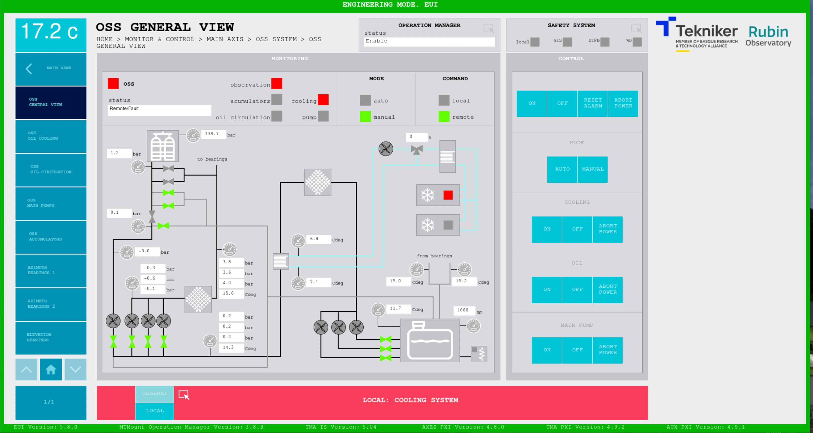

The **Alarm History** screen shows

.. figure:: ./_static/alarm_history.png
    :name:  Alarm History

in more detail, it shows:

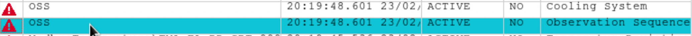

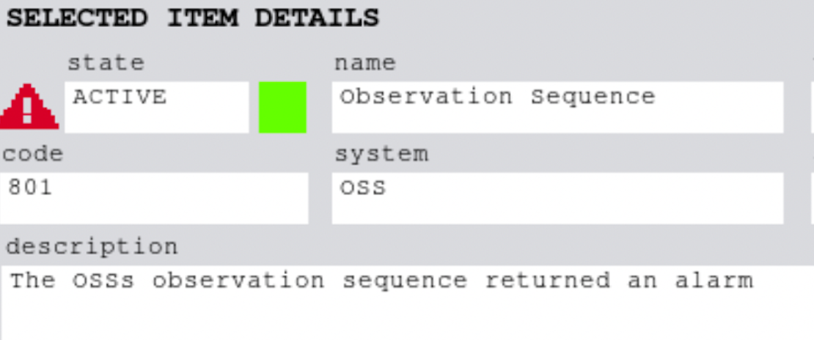

.. _Title-of-Troubleshooting-Procedure-Procedure-Steps:

Procedure Steps
===============

.. todo::
   Make sure everything is in a safe or idle state before troubleshooting. Describe relevant safety steps if necessary.

.. This section should include the procedure. There is no strict formatting or structure required for procedures. It is left to the authors to decide which format and structure is most relevant.
.. In the case of more complicated procedures, more sophisticated methodologies may be appropriate, such as multiple section headings or a list of linked procedures to be performed in the specified order.
.. For highly complicated procedures, consider breaking them into separate procedure. Some options are a high-level procedure with links, separating into smaller procedures or utilizing the reST ``include`` directive <https://docutils.sourceforge.io/docs/ref/rst/directives.html#include>.

.. _Title-of-Troubleshooting-Procedure-Critical-Step-1:

 1. Go to Level 1 Machinery Room and bring a Philips screwdriver with you. The Machinery Room is in the left door in the picture below.

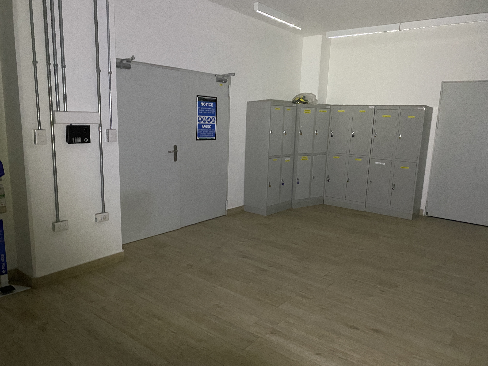

2. The screens in the front panel of one or both of the chiller cabinets would display an alarm. On the top, the red band may say: **“STATUS: NOT ACKNOWLEDGED”** or **“STATUS: ALARM”**

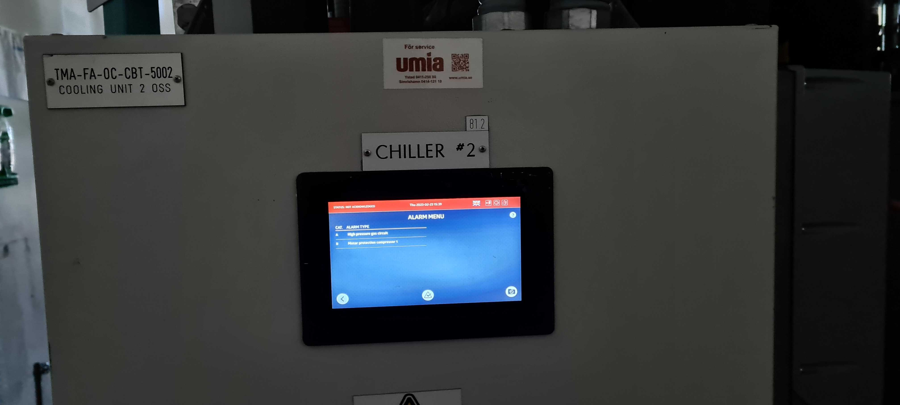

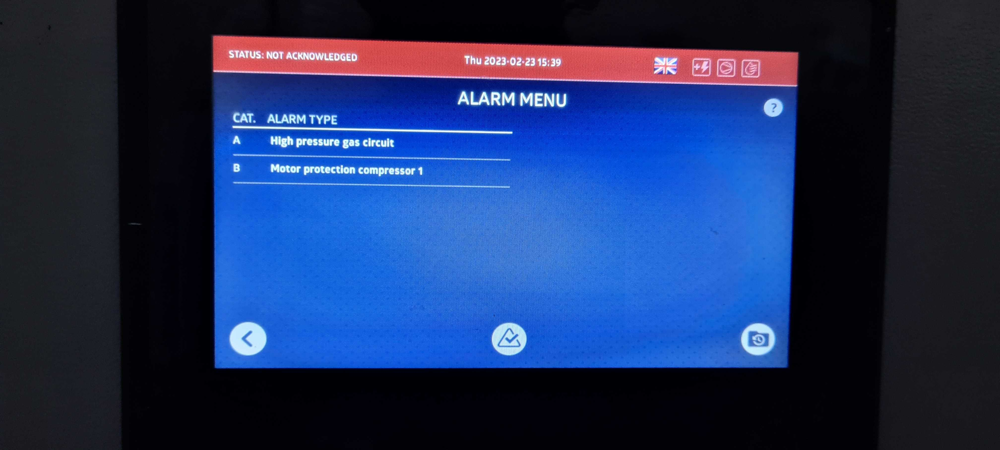

The large grey box on the cabinet's side (purple arrow) shows a blinking red light and an interlock in the screen.

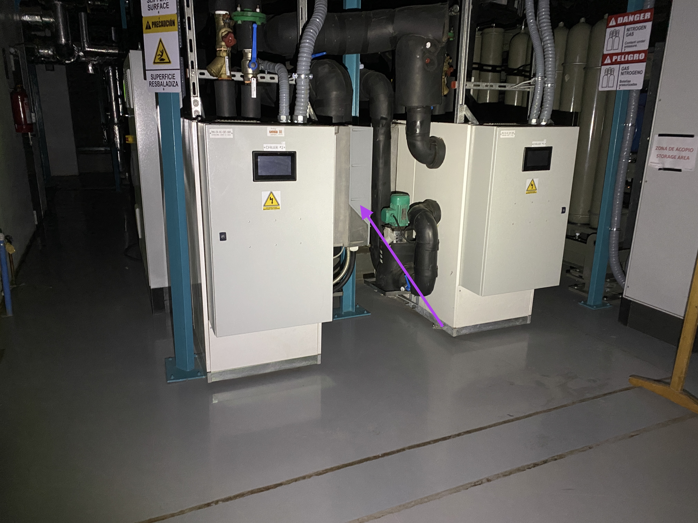

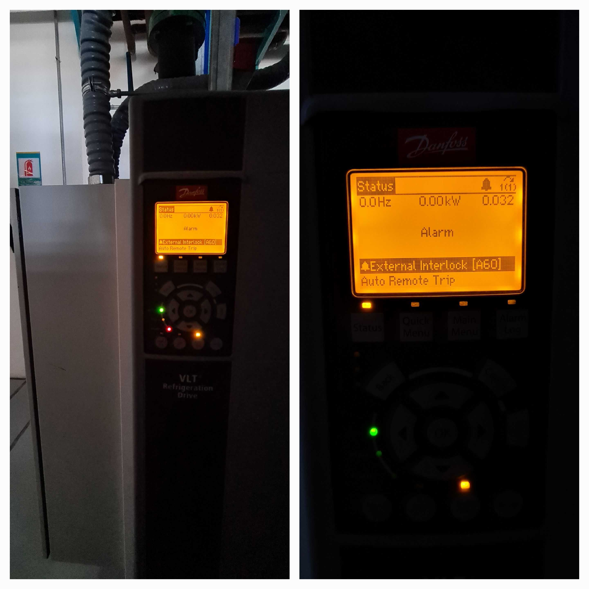

3. There are two reset buttons inside the chiller cabinet that needs to be pressed. From the side of the cabinet, use the screwdriver to remove two screws that are located on top. This will allow you to remove the cover panel.
 Each cabinet has two panels. In chiller #2 the reset buttons are within the furthermost panel (Image below), while in chiller#1 they are found under the panel closer to the front face of the chiller.

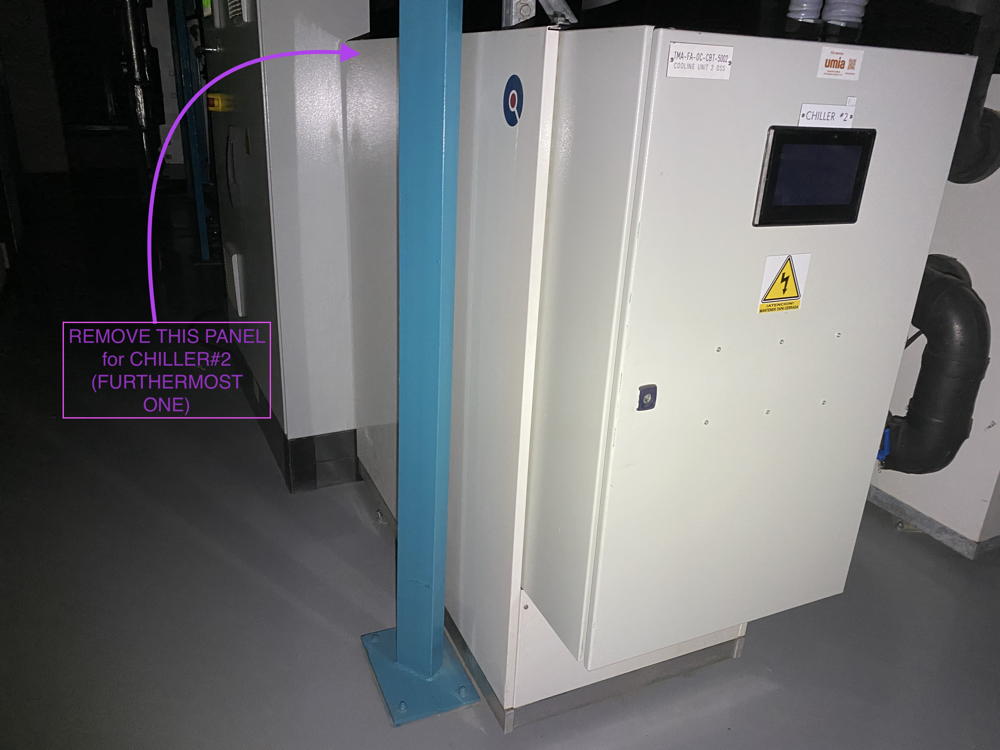

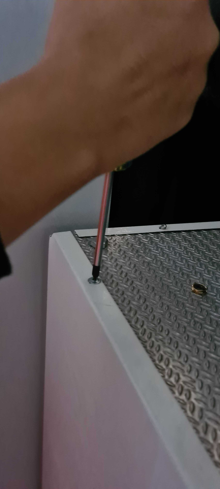

4. Press each of the red reset buttons inside the cabinet for 3 seconds (TBC: order does not matter):

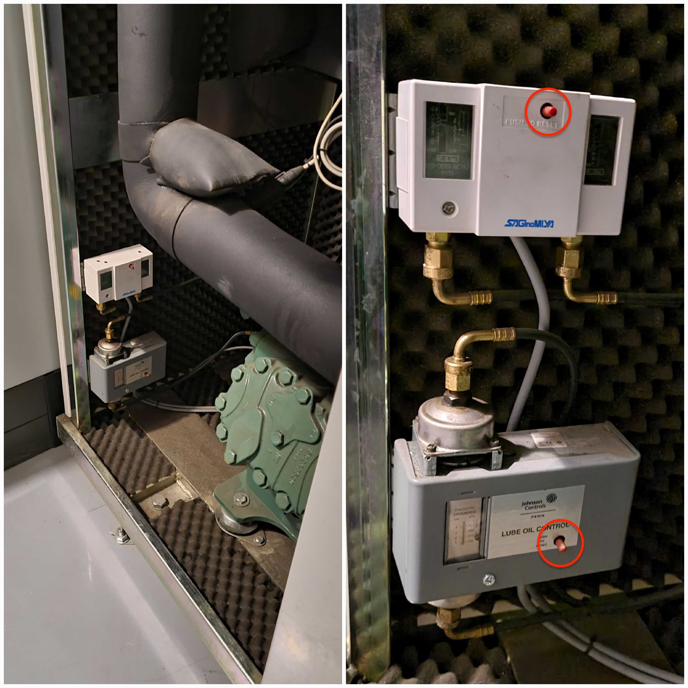

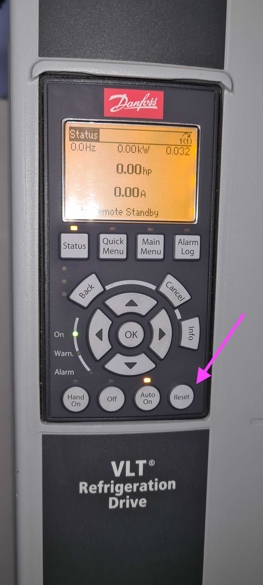

   .. _Title-of-Troubleshooting-Procedure-Final-Step:

5. Press the reset button on the large grey box on the side of the cabinet. The red alarm light should stop blinking.

6. Acknowledge the alarms by pressing the tick mark on the bottom of the screen. After perhaps a minute or two, the front screen should show **"STATUS:OK"**

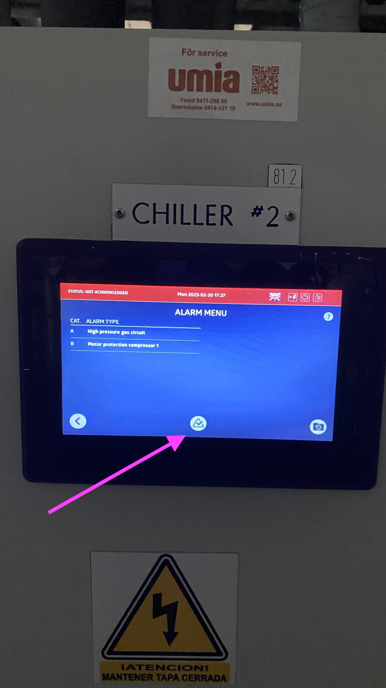

7. Repeat **steps 2-6** with the other chiller, if it shows an alarm.    

8. Back to the control room, reset the alarm in the TMA EUI **"Safety System"** screen. Click on the red **"OSS malfunction"** and press **"RESET SELECTED"**. The red colour should dissapear.

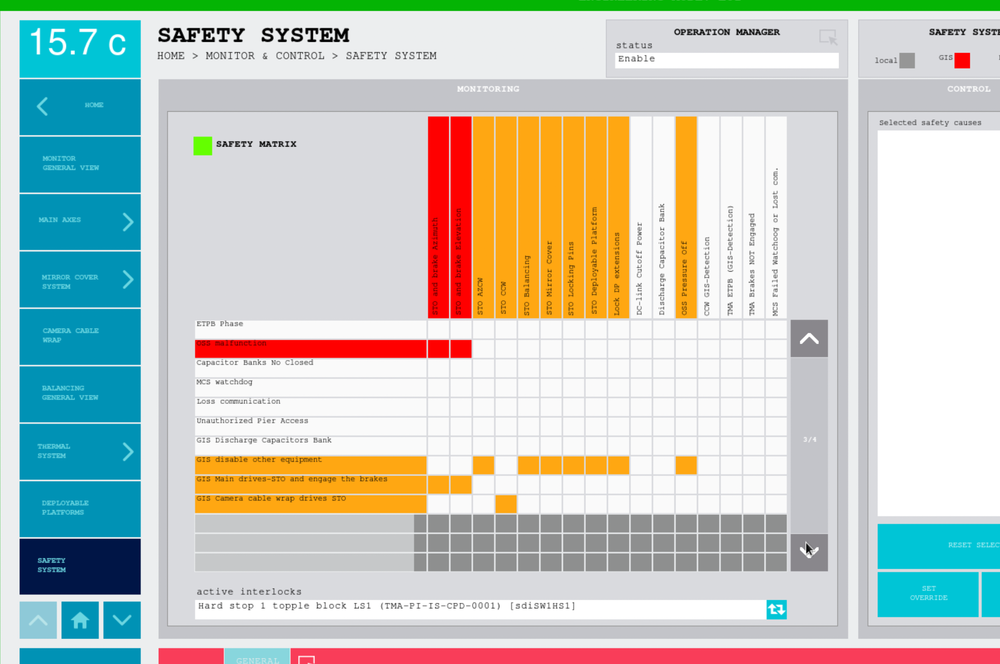

.. _Title-of-Troubleshooting-Procedure-Condition-A-for-Step-4:

Post-Condition
==============

.. This section should provide a simple overview of conditions or results after executing the procedure; for example, state of equipment or resulting data products.
.. It is preferred to include them as a bulleted or enumerated list.
.. Please provide screenshots of the software status or relevant display windows to confirm.
.. Do not include actions in this section. Any action by the user should be included in the end of the Procedure section below. For example: Do not include "Verify the telescope azimuth is 0 degrees with the appropriate command." Instead, include this statement as the final step of the procedure, and include "Telescope is at 0 degrees." in the Post-condition section.

- The system should be now ready to turn On the OSS again.

.. _Title-of-Troubleshooting-Procedure-Contingency:

Contingency
===========

If the procedure was not successful, report the issue in channel *#summit-simonyi* and/or activate the :ref:`Out of hours support <Safety-out-of-hours-support>`.