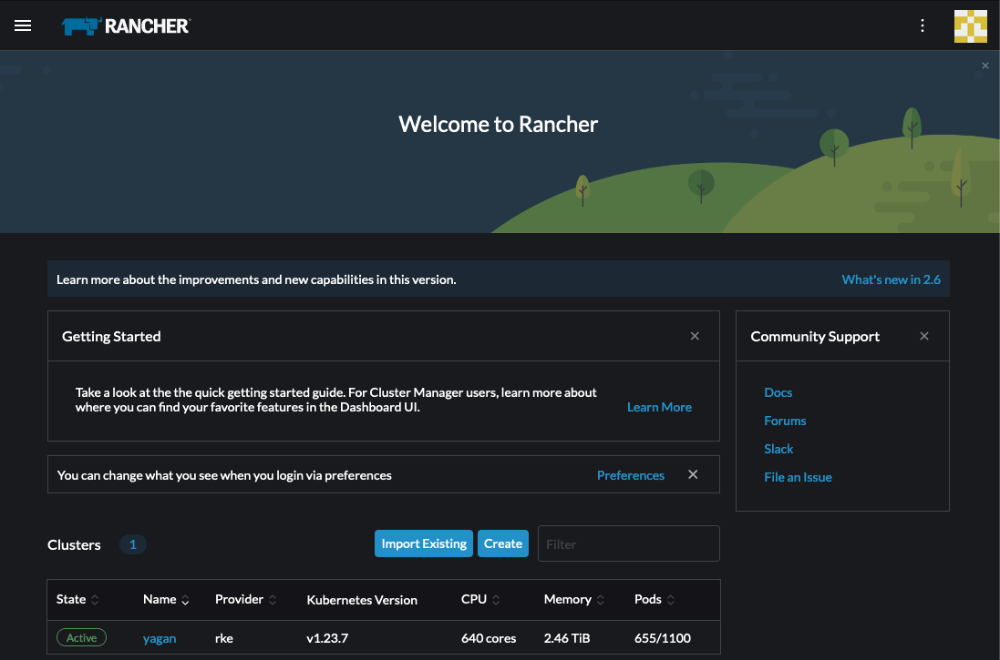
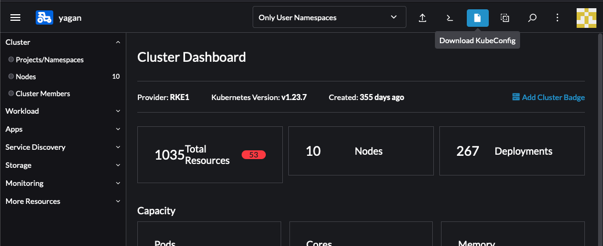
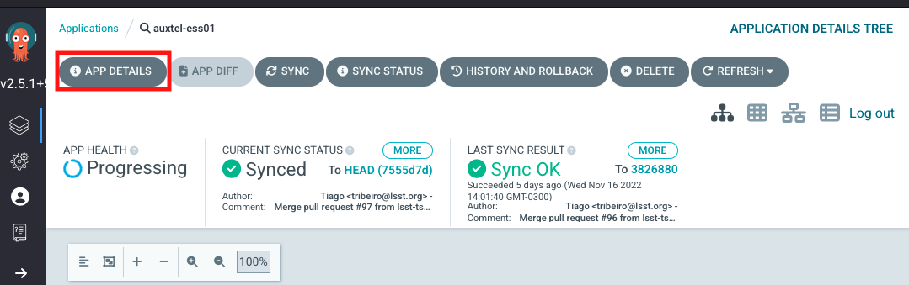
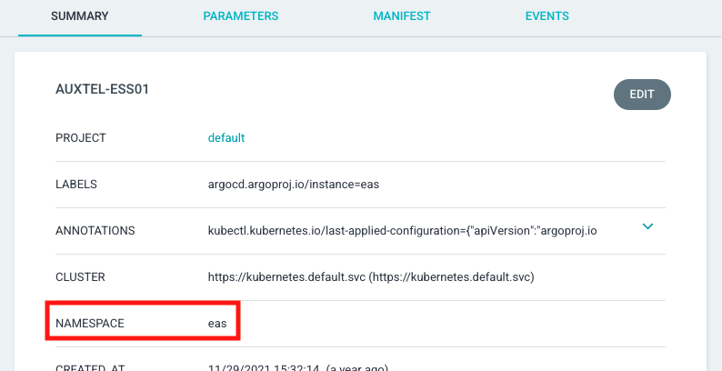

.. |author| replace:: *Wouter van Reeven*
.. |contributors| replace:: *Tiago Ribeiro*

.. _remote-login:

###############################
Remote login to a CSC container
###############################

.. warning::

    This procedure contains steps that may affect the system in critical ways.

    If you are unsure about any of the steps described here, contact support personnel.

Occasionally it may be necessary to test an update to the configuration of a component before tagging a new version of the configuration project.

Most components on Rubin system run as containers on a Kubernetes cluster.
Therefore, restarting the component after making changes will erase all changes.

To connect to the container in the Kubernetes cluster, the ``kubectl`` command can be used.

In order to do that, several items and pieces of information are needed:

    * The KubeConfig file to connect to the kubernetes cluster
    * The namespace in which the component has been deployed

The KubeConfig file can be downloaded from rancher.
For the application link, see :ref:`Observing-Interface-Operational-Environments`.
In order to login, you need to use your IPA credentials.
Once logged in, you see a list of the available kubernetes clusters.
Click on the name of the cluster that you are trying to connect to.

In the screenshot, you can see the available clusters for the summit.
For the summit, you should connect to the ``yagan`` cluster.

You can then download the KubeConfig file by clicking on the Download button in the upper right of the screen.

Next, find the argo-cd application link for the environment you are working on.
For that see :ref:`Observing-Interface-Operational-Environments` again.

The credentials are in the 1Password ArgoCD Admin vault.
If you do not have access to the vault and feel like you should, contact |author| or |contributors|.

Once in :ref:`argo-cd <fig-argo-cd>` you will see a page showing several boxes with a component name on top and some service information at the bottom.

.. figure:: ./_static/argo-cd.png
    :name: fig-argo-cd

Use the search bar to find the component you want to know the namespace for.
The services usually have the same as the component, with some small variations.
Once you find the one you are looking for click on the box to see details about the deployment.
Then you can click the ``APP DETAILS`` button to get the details of the application, including the namespace.

If you do not see the component you are looking for, it might be that it is not deployed in the Kubernetes container.
Examples of components that are not deployed in argo-cd are:

* Camera systems; ATCamera, CCCamera, LSSTCamera.
* OODS.
* M1M3 hardware mode.
* ATMCS
* ATPneumatics

Components not in argo-cd will have custom startup procedures that should be described elsewere.

For this example, let us take a look at the ``auxtel-ess01`` component.
The :ref:`detailed page <fig-argo-cd-info>` for this component can be seen below.

The red rectangle highlights the ``APP DETAILS`` button.
Click that to get the details of the application, including the namespace in which it has been deployed.

The red rectangle highlights the namespace for this particular application, ``auxtel-ess01``.

In order to be able to connect to the container of your application, you will need to have the ``kubectl`` command installed on your laptop/computer.
Instructions for installing the ``kubectl`` command are not included here.
In order to list all pods (which is how the containers are called in a kubernetes cluster) in the namespace of your application, you can issue the following command.

.. prompt:: bash

    $ kubectl --kubeconfig=${HOME}/.kube/<kubeconfig> get pod -o=custom-columns=NAME:.metadata.name,STATUS:.status.phase,NODE:.spec.nodeName -n <namespace>

In the above bash command, replace ``<kubeconfig>`` with the name of the file that you downloaded and ``<namespace>`` with the namespace you obtained from argo cd.
Note that it is assumed that you have placed the ``<kubeconfig>`` file in the ``.kube`` directory in your home directory.
If you have placed the ``<kubeconfig>`` file in a different file, update the bash command accordingly.

As an example, this is an output for the ``eas`` namespace on the ``yagan`` (summit) cluster:

.. prompt:: bash

    NAME                           STATUS    NODE
    auxtel-ess01-mk9rx             Running   yagan02
    auxtel-ess02-hmpjm             Running   yagan02
    dimm1-z4mpq                    Running   yagan02
    dimm2-6mfsw                    Running   yagan01
    hvac-nhznj                     Running   yagan01
    mtcameraassembly-ess01-qsspl   Running   yagan02
    mtdome-ess01-22bzj             Running   yagan03
    mtdome-ess02-xznk2             Running   yagan01
    mtdome-ess03-qkg5q             Running   yagan05

Note that the previously mentioned ``auxtel-ess01`` is listed as ``auxtel-ess01-mk9rx``, which is the name of the pod to connect to.

In order to connect to your pod, you can use the following command.

.. prompt:: bash

    $ kubectl --kubeconfig=${HOME}/.kube/<kubeconfig> exec --stdin --tty <pod-name> -n <namespace> -- /bin/bash

In the above bash command, again replace ``<kubeconfig>`` with the name of the file that you downloaded and ``<pod-name>`` with the name of the pod that you obtained with the previous bash command.
Make sure to adjust the path to your ``<kubeconfig>`` file again if this is in a different location than assumed in the command.

Now you should have connected to the running container and you can make the changes as necessary.
