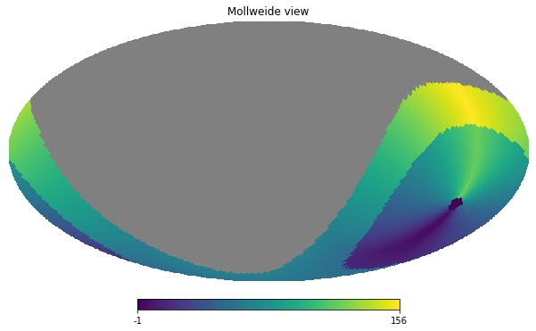
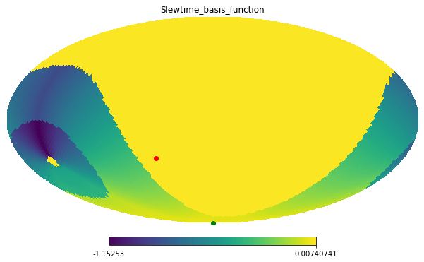
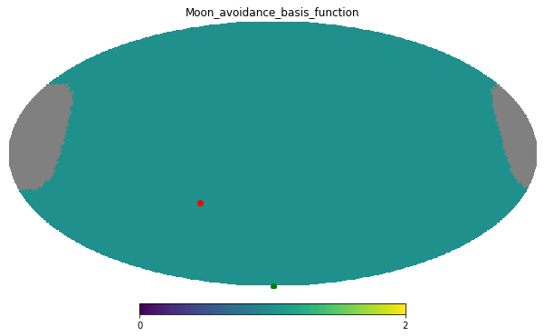
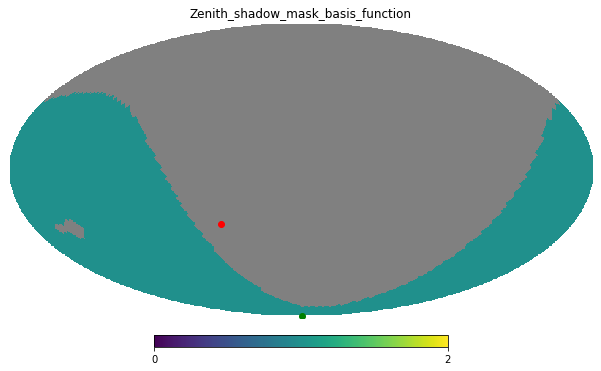
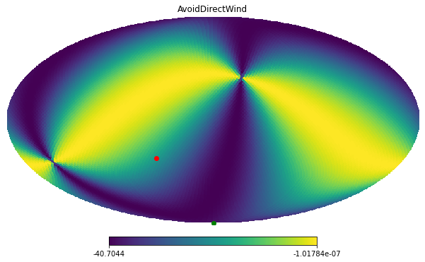

.. _troubleshooting-the-scheduling-algorithm:

##########################################
Troubleshooting the *Scheduling Algorithm*
##########################################

This page is dedicated to troubleshooting the Feature Based Scheduler (_`FBS`) algorithm, which is the main *scheduling algorithm* for the Scheduler CSC.

In general, this will be the last line of resource users will have to resort to when debugging issues at night time.
Nevertheless, one may be interested in inspecting the state of the `FBS`_ at any time if they are interested in having a better idea of the scheduler operational conditions.

Before proceeding make sure you read and understand the :ref:`scheduler-operational-procedures-overview` section, 
which gives a high level description of the Scheduler CSC architecture, the *scheduling algorithm* and the FBS.

.. _troubleshooting-the-scheduling-algorithm-environment-setup:

Environment Setup
=================

In short, troubleshooting the FBS boils down to inspecting snapshots of the Python object that represents a survey configuration.
These snapshot are python pickle files generated by the Scheduler CSC that can be loaded on different machines, so long as the environment used to load them is compatible with that of the machine that generated it.

Unfortunately, the standard nublado environment has a different set of packages than the Scheduler CSC.
Therefore we need to create a new environment on nublado to be able to load and inspect the snapshots generated by the Scheduler.

The process is as follows:

#.  From your nublado instance, open a new terminal and load the DM environment with:

    .. prompt:: bash

        source $LOADSTACK

#.  Create a new conda environment:

    .. prompt:: bash

        conda create --name scheduler-dev python=3.8

#.  Activate the new environment:

    .. prompt:: bash

        conda activate scheduler-dev

#.  Install the rubin-sim package with mamba: 

    .. prompt:: bash

        mamba install -c lsstts -c conda-forge rubin-sim ipykernel

    The rubin-sim package contains several modules for simulating and analysing Rubin data, and includes the feature based scheduler module, we will need to inspect the snapshots.

#.  Create a notebook environment with the scheduler-dev conda environment:

    .. prompt:: bash

        ipython kernel install --name "scheduler-dev" --user
    
    This will allow us to select the "scheduler-dev" environment for our Jupyter notebooks.

After the steps above are completed, create a new notebook.
On the top-right-hand side, click on the environment name, where it is says "LSST" and follow the sequence below to select the "scheduler-dev" environment.

.. list-table:: 

    * - .. figure:: ./_static/new-jupyter-notebook-lsst.png
    * - .. figure:: ./_static/new-jupyter-notebook-lsst-selected.png
    * - .. figure:: ./_static/new-jupyter-notebook-lsst-select-kernel.png
    * - .. figure:: ./_static/new-jupyter-notebook-scheduler-dev-selection.png
    * - .. figure:: ./_static/new-jupyter-notebook-scheduler-dev.png

You are now ready to analyze some Scheduler snapshots.

.. note::

    The environment we created to analyze the scheduler snapshots does not have the libraries required to access the control system.
    Keep that in mind for the following procedures.

.. _troubleshooting-the-scheduling-algorithm-retrieving-snapshots:

Retrieving Snapshots
====================

To retrieve a snapshot created by Scheduler, first we need to find its ``url``.
For that, follow the :ref:`advanced-scheduler-operations-find-last-scheduler-snapshot` procedure.

Once you have the ``url`` you can retrieve the snapshot directly from a notebook.

We will use this same notebook to analyze the data, so we start by loading all the libraries we will need.

.. code-block:: python

    import io
    import os
    import math
    import pickle
    import importlib

    import urllib.request

    import numpy as np
    import healpy as hp

In the cell below we use the same ``url`` found in :ref:`advanced-scheduler-operations-find-last-scheduler-snapshot`, 
make sure to update the entire string with the appropriate value.

.. code-block:: python

    uri = "https://s3.cp.lsst.org/rubinobs-lfa-cp/Scheduler:2/Scheduler:2/2022/02/17/Scheduler:2_Scheduler:2_2022-02-18T09:26:04.347.p"

Now we use ``urlretrieve`` to download the file and save it to a local file named ``scheduler_snapshot.p``.

.. code-block:: python

    dest, _ = urllib.request.urlretrieve(url=uri, filename="./scheduler_snapshot.p")

Finally, we load the content of the snapshot.

.. code-block:: python

    with open(dest, "rb") as fp:
        scheduler, conditions = pickle.load(fp)

As you can see from the code above, the snapshot contains two different objects when unpacked; ``scheduler`` and ``conditions``.
The first object, as the na suggests, contains the FBS snapshot.
The second object contains a snapshot of the last set of telemetry passed to the ``scheduler``.
We will need these two objects for the exploratory analysis we will do next.

.. _troubleshooting-the-scheduling-algorithm-the-conditions-snapshot:

The *conditions* Snapshot
=========================

Before diving into the *scheduler* snapshot, let us take a quick glance at the *conditions* snapshot.

As mentioned above this object contains a snapshot of the telemetry stream.
You can check what are all the attributes on this object with the following:

.. code-block:: python

    [attr for attr in dir(conditions) if not attr.startswith("__")]

You will notice it contains things like ``telAlt``, ``telAz``, ``rotTelPos``, ``telDec``, ``telRA``, which are determined from the observatory state.
There are things like ``wind_direction`` and ``wind_speed`` which are obtained from the weather station telemetry stream.
These are all single scalars.

Nevertheless, the telemetry stream also contains some healpix maps.
Probably the most interesting one is ``slewtime``, which contains a map of the slew time constructed by the observatory model.
We can visualize the slew time healpix map with the following:

.. code-block:: python

    hp.mollview(conditions.slewtime)

.. _troubleshooting-the-scheduling-algorithm-analysing-the-scheduler-snapshot:

Analyzing the *scheduler* Snapshot
==================================

The first step in analyzing the scheduler snapshot is understanding its structure.
As mentioned in :ref:`scheduler-operational-procedures-overview` and shown in the :ref:`FBS architecture diagram <fig-fbs-architecture>`, there is an hierarchical tree of ``surveys``, ``basis functions`` and ``features``.

On the ``scheduler`` snapshot that can be seen by the following:

.. code-block:: python

    scheduler.survey_lists

The ``survey_lists`` attribute of the ``scheduler`` object contains a *list of lists* of ``Survey`` objects. Each ``Survey`` object contains a ``basis_functions``  which is a list of ``BasisFunction`` objects.
Inspecting the features are usually less useful, but each ``BasisFunction`` object contains a ``survey_features`` attribute which is a dictionary of features.

The following code snippet can produce a textual overview of the structure of the scheduler:

.. code-block:: python 

    display_filename_prefix_middle = '├──'
    display_filename_prefix_last = '└──'
    display_parent_prefix_middle = '    '
    display_parent_prefix_last = '│   '

.. code-block:: python

    def get_classname(obj):
        return f"{obj!r}".split(" ")[0].split(".")[-1]

.. code-block:: python 

    def generate_prefix(current_prefix, list_size):
        prefix = current_prefix
        if i < list_size-1:
            prefix += display_filename_prefix_middle
        else:
            prefix += display_filename_prefix_last
        return prefix

.. code-block:: python 

    survey_size = ", ".join([f"{len(survey)}" for survey in scheduler.survey_lists])
    print(f"Total number of surveys: {sum([len(survey) for survey in scheduler.survey_lists])} -> [{survey_size}]")

    print(f"Number of survey lists: {len(scheduler.survey_lists)}")
    for i, survey_list in enumerate(scheduler.survey_lists):
        prefix = generate_prefix(display_parent_prefix_middle, len(scheduler.survey_lists))
        print(f"{prefix} Number of surveys in list {i+1}: {len(survey_list)}")

        for j, survey in enumerate(survey_list):
            pprefix = generate_prefix(display_parent_prefix_middle + display_parent_prefix_last + display_parent_prefix_middle, len(survey_list))
            print(f"{pprefix} {get_classname(survey)}[{survey.survey_name}]")
                        
            for k, basis_function in enumerate(survey.basis_functions):
                ppprefix = generate_prefix(display_parent_prefix_middle + display_parent_prefix_last + display_parent_prefix_middle + display_parent_prefix_last, len(survey.basis_functions))
                is_healpix = "[helpix map]" if hasattr(basis_function(conditions), '__len__') else ""
                print(f"{ppprefix} {get_classname(basis_function)} :: Feasibility: {basis_function.check_feasibility(conditions)} {is_healpix}")

The code above will show something like the following:

.. code-block:: text

    Total number of surveys: 236 -> [1, 212, 11, 12]
    Number of survey lists: 4
        ├── Number of surveys in list 1: 1
        │       └── Greedy_survey[cwfs]
        │       │   ├── Not_twilight_basis_function :: Feasibility: True 
        │       │   ├── Slewtime_basis_function :: Feasibility: True [helpix map]
        │       │   ├── Slewtime_basis_function :: Feasibility: True 
        │       │   ├── Slewtime_basis_function :: Feasibility: True 
        │       │   ├── Moon_avoidance_basis_function :: Feasibility: True [helpix map]
        │       │   ├── Zenith_shadow_mask_basis_function :: Feasibility: True [helpix map]
        │       │   ├── VisitGap :: Feasibility: False 
        ├── Number of surveys in list 2: 212
        │       ├── FieldSurvey[LATISS_MD02_00000001]
        │       │   ├── Not_twilight_basis_function :: Feasibility: True 
        │       │   ├── Hour_Angle_limit_basis_function :: Feasibility: False 
        │       │   ├── Slewtime_basis_function :: Feasibility: True [helpix map]
        │       │   ├── Slewtime_basis_function :: Feasibility: True 
        │       │   ├── Slewtime_basis_function :: Feasibility: True 
        │       │   ├── Moon_avoidance_basis_function :: Feasibility: True [helpix map]
        │       │   ├── Zenith_shadow_mask_basis_function :: Feasibility: True [helpix map]
        │       │   ├── VisitGap :: Feasibility: False 
        │       │   ├── AvoidDirectWind :: Feasibility: True [helpix map]
        │       │   ├── BalanceVisits :: Feasibility: True 
        │       ├── FieldSurvey[LATISS_MD02_00000002]
        │       │   ├── Not_twilight_basis_function :: Feasibility: True 
        │       │   ├── Hour_Angle_limit_basis_function :: Feasibility: False 
        │       │   ├── Slewtime_basis_function :: Feasibility: True [helpix map]
        │       │   ├── Slewtime_basis_function :: Feasibility: True 
        │       │   ├── Slewtime_basis_function :: Feasibility: True 
        │       │   ├── Moon_avoidance_basis_function :: Feasibility: True [helpix map]
        │       │   ├── Zenith_shadow_mask_basis_function :: Feasibility: True [helpix map]
        │       │   ├── VisitGap :: Feasibility: False 
        │       │   ├── AvoidDirectWind :: Feasibility: True [helpix map]
        │       │   ├── BalanceVisits :: Feasibility: True 
        ...

This allows you to see which surveys are defined, which basis functions are part of each survey, the "feasibility" of each basis function and a note when the basis function is a helpix map (this will be useful furthermore).
Feasibility, is the "first line of defence" of a basis function.
It determines whether a basis function yield observations for a given set of conditions.
This "superseeds" the actual "score" of the basis function.

In the case above you can see, for instance, that both the ``Hour_Angle_limit_basis_function`` and ``VisitGap`` on the ``FieldSurvey[LATISS_MD02_00000001]`` survey are ``False``.
If one basis function from a survey is not feasible, it means it cannot be scheduled at this time.
It this case, the ``Hour_Angle_limit_basis_function`` is telling us the survey is out of the specified hour angle limits, and therefore cannot be observed.
Furthermore, the ``VisitGap`` basis function specifies a minimum time between consecutive observations of a survey have not passed.

Usually, when trying to understand lack of observations, the first thing to check is whether there are feasible surveys in the first place and, if not, why they are not feasible.
In most cases, it is obvious from the basis function name.

It may still happen that although all basis functions are feasible, we still do not get targets.
This happens mostly because "feasibility" is a high level check, and details on the basis functions may still render the survey non-observable, although still feasible.
To get to this level of understanding, one needs to analyse the basis function value.
Some knowledge of the different kinds of surveys might also be necessary to get a full picture.

In the summary above, there are two different types of surveys; ``Greedy_survey`` and ``FieldSurvey``.
The ``Greedy_survey`` is a "region" based survey, which allows users to specify an area on the sky to be surveyed according to several constraints imposed by the basis functions.
The ``FieldSurvey``, allows one to specify a field (determined by its RA and Dec coordinates), which will be observed according to the constraints imposed by its basis functions.

.. note::

    Although the imaging survey on AuxTel is supposed to map a "region" of the sky, it would require an extremely high sky resolution to allow us to define it in terms of a ``Greedy_survey``.
    Therefore we use ``FieldSurvey`` configured with individual pointings.
    This allows us to run the scheduler with a lower resolution and still map the region.

In the example above we already know that the ``LATISS_MD02_*`` fields are still outside the hour angle limit, so they won't be observable.
Still let us explore some of the basis functions rewards as an exercise.

The first thing to keep in mind is that basis functions reward values can either be single floats, or healpix maps.
The ones we will be most interested in analyzing are healpix maps, probably comparing them with the current position of the telescope and, in the case of ``FieldSurvey``-like surveys, the position of the field.

Let's analyze the basis function of ``FieldSurvey[LATISS_MD02_00000001]``, the first survey on the second list of surveys.
We start by extracting the survey into a variable:

.. code-block:: python

    survey = scheduler.survey_lists[1][0]

In the summary above we show a note when the basis function returns a healpix map.
For ``FieldSurvey[LATISS_MD02_00000001]`` we can see that there are four basis functions in this condition; ``Slewtime_basis_function``, ``Moon_avoidance_basis_function``, ``Zenith_shadow_mask_basis_function`` and ``AvoidDirectWind``.
We can show each of these maps with the current position of the telescope and the position of the field with the following:

.. code-block:: python

    fig_num = 1
    for bfs in survey.basis_functions:
        bfs_value = bfs(conditions)
        if hasattr(bfs_value, "__len__"):        
            hp.mollview(bfs_value, title=get_classname(bfs), fig=fig_num)
            hp.projscatter(np.degrees(survey.ra), np.degrees(survey.dec), lonlat=True, coord="E", color="red")
            hp.projscatter(np.degrees(conditions.telDec), np.degrees(conditions.telDec), lonlat=True, coord="E", color="green")
            fig_num += 1    

The position of the field is shown as a red dot in the map, and the position of the telescope as a green dot.
In this particular case, the telescope was pointing towards the south celestial pole. Hence the green dot is shown as the bottom part of the sky projection.

From the images above one can see why the hour angle limit is yielding the survey unfeasible, as the targets are still below the horizon, as  can be seen on the ``Slewtime_basis_function`` and the ``Zenith_shadow_mask_basis_function``.

This should give you enough information to allow you to troubleshoot most conditions experienced by the scheduler and also to understand what the scheduler is doing at a particular moment in time.
