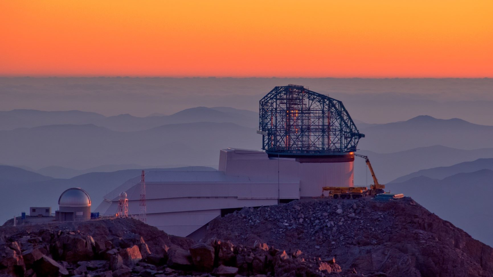

.. This is a template .rst file for a directory in the procedure's arm of the documentation. This template should be used for the directory's index.rst, and may be used to generate other pages within the directory. This comment may be deleted when the template folder is copied to the destination.

.. Review the README in this directory on instructions to contribute.
.. Static objects, such as figures, should be stored in the _static directory. Review the _static/README in this file's directory on instructions to contribute.
.. Do not remove the comments that describe each section. They are included to provide guidance to contributors.
.. Do not remove other content provided in the templates, such as a section. Instead, comment out the content and include comments to explain the situation. For example:
    - If a section within the template is not needed, comment out the section title and label reference. Do not delete the expected section title, reference or related comments provided from the template.
    - If a file cannot include a title (surrounded by ampersands (#)), comment out the title from the template and include a comment explaining why this is implemented (in addition to applying the ``title`` directive).

.. This is the label that can be used as for cross referencing this file.
.. Recommended format is "Directory Name"-"Title Name"  -- Spaces should be replaced by hyphens.
.. _Obs-Ops-Rubin-Observatory-Operations-Documentation:
.. Each section should includes a label for cross referencing to a given area.
.. Recommended format for all labels is "Title Name"-"Section Name" -- Spaces should be replaced by hyphens.
.. To reference a label that isn't associated with an reST object such as a title or figure, you must include the link an explicit title using the syntax :ref:`link text <label-name>`.
.. An error will alert you of identical labels during the build process.

##########################################
Rubin Observatory Operations Documentation
##########################################

.. This section should provide a brief, top-level description of the page.

.. Important::

    This documentation area is under heavy development and only in the very early stages of design.
    It should not be used nor consulted for a place of information at this time.

Observatory Operations consists of multiple levels of interactions and procedures occurring simultaneously in many places and timezones.
This section of documentation focuses on the resources needed for observers, commissioning personnel, and support staff to facilitate night-time operations.

The scope of this area of documentation is to provide a centralized, version controlled space where resources are either located, or linked appropriately.
The content is provided as reference only.
All aspects of the project that go through strict change control (e.g. mirror procedures) should only be linked to these pages.

.. _Obs-Ops-Safety:

Safety: Quick Reference for Nighttime Personnel
================================================

.. warning::
    Safety of personnel first and equipment second is the utmost priority of Rubin Observatory. 
    The safety information here is meant to serve as a quick look for nighttime support staff in 
    case of an emergency on the summit.
    It does not replace the required safety training to be on the summit at night. 

Here is included:

- Procedures on who (and how) to call when there is an issue
- Location of keys, passwords etc
- What to do in case of vehicle failure, power-outage, fire etc.
.. - Procedures to enter telescope spaces during operations (e.g. AuxTel)
- Emergency meeting locations etc.

.. toctree::
   :glob:
   :titlesonly:
   :maxdepth: 2
   
   Safety <Safety/index>

Observing Constraints
=====================

.. toctree::
   :glob:
   :titlesonly:
   :maxdepth: 2
   
   Constraints <Observing-Constraints/Observing-Constraints-index>

.. _Obs-Ops-MainTel-Operations:

Simonyi Telescope Operations
============================

Herein lies comprehensive information for Simonyi Telescope operations. 
It covers essential aspects of the standard operations and other non-routine procedures, alongside 
troubleshooting guidance for common issues encountered during the stages of system integration, testing and commissioning.

.. toctree::
    :glob:
    :maxdepth: 2 
    :titlesonly:
    

    Simonyi <MainTel/MainTel-index>

.. _Obs-Ops-AuxTel-Operations:

Auxiliary Telescope Operations
==============================

Under this section is comprised information and procedures pertinent to the operation of the Auxiliary Telescope. 
It includes the standard operations for an ordinary, scheduler-driven observation night, 
as well as unique procedures and manual interventions that may be needed under more exceptional circumstances. 
It also incorporates an exhaustive list of identified problems and their corresponding troubleshooting guidelines 
to recover functionality of the Auxiliary Telescope and LATISS. 

.. toctree::
    :glob:
    :maxdepth: 2 
    :titlesonly:
    

    AuxTel <AuxTel/AuxTel-index>

.. _Obs-Ops-Observatory-Control-System:

Observatory Control System
==========================

Here is offered an extensive exploration of the observatory's control system. 
It provides comprehensive information on system components, their operations, configuration, along with troubleshooting support. 
Additionally, it provides an inventory of valuable observing tools to facilitate data visualization and system monitoring 
during nighttime operations. 

.. toctree::
    :glob:
    :maxdepth: 2 
    :titlesonly:
    

    Observatory <Observatory-Control-System/Observatory-Control-System-index>

.. _Obs-Ops-Daytime-Nighttime-Interactions:

Daytime/Nighttime Interactions
==============================

This section describes the procedures for documenting events and work completed during the day and night. 
Daytime work should be summarized concisely to minimize the time for the night staff to prepare for on sky observations. 
Night events should be well-documented so day time staff can resolve issues as efficiently as possible. 

.. toctree::
   :maxdepth: 2
   :glob:
   :titlesonly:

   Communication <Daytime-Nighttime-Interactions/index>

.. .. _Obs-Ops-NightTime-Operations:

.. Nighttime Operations
.. ======================

.. Standard nighttime operations are listed in this section. 
.. This includes opening the telescopes for data collection and end-of-night procedures. 
.. Special operations or engineering tasks are described in a different section (link TBD). 

.. .. toctree::
..     :maxdepth: 4
..     :glob:
..     :titlesonly:

..     Nighttime <Nighttime-Operations/index>

.. .. _Obs-Ops-Troubleshooting:

.. Non-Standard Operations
.. =======================

.. This includes any non-standard operations often requiring unique protocols or manual interventions, such as shutdown and recovery of the computer room, response to incidents, etc.

.. .. toctree::
..    :maxdepth: 2
..    :glob:
..    :titlesonly:

..    Non-Standard-Operations/index

.. .. _Obs-Ops-Non-Standard-Opertaions:

.. Troubleshooting
.. ======================

.. This section includes information on current known issues that are not addressed in other areas of the documentation. 
.. Content includes temporary issues and potential work-arounds. 
.. The section is continually updated as the observatory system evolves and develops. 
.. If the problem persists after exhausting all documented procedures, ensure safety of the equipment, stop work, and call for help.

.. .. toctree::
..     :maxdepth: 4
..     :glob:
..     :titlesonly:
    
..     Trobleshooting <Troubleshooting/index>
 

.. _Obs-Ops-Project-Documentation-Information:

Project Documentation Information
=================================

Describes information regarding this documentation tree, including how to contribute.

.. toctree::
    :maxdepth: 2
    :glob:
    :titlesonly:

    Contribute <project/index>

.. _Obs-Ops-Observing-Interface-Setup:

Observing Interface Setup
=========================

Contains detailed instructions on how to set the required environment for operations and/or interaction with the system during testing and commissioning. 

.. toctree::
    :maxdepth: 2
    :glob:
    :titlesonly:

    Setup <Observing-Interface-Setup/index>

.. _Obs-Ops-Operational-Tutorials:

System Testing, Deployments, and Upgrades
==========================================

Content moved to https://obs-controls.lsst.io/.
