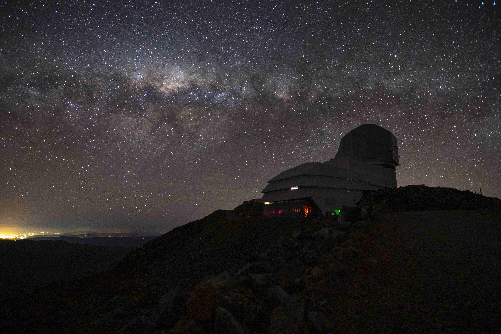

.. This is a template .rst file for a directory in the procedure's arm of the documentation. This template should be used for the directory's index.rst, and may be used to generate other pages within the directory. This comment may be deleted when the template folder is copied to the destination.

.. Review the README in this directory on instructions to contribute.
.. Static objects, such as figures, should be stored in the _static directory. Review the _static/README in this file's directory on instructions to contribute.
.. Do not remove the comments that describe each section. They are included to provide guidance to contributors.
.. Do not remove other content provided in the templates, such as a section. Instead, comment out the content and include comments to explain the situation. For example:
    - If a section within the template is not needed, comment out the section title and label reference. Do not delete the expected section title, reference or related comments provided from the template.
    - If a file cannot include a title (surrounded by ampersands (#)), comment out the title from the template and include a comment explaining why this is implemented (in addition to applying the ``title`` directive).

.. This is the label that can be used as for cross referencing this file.
.. Recommended format is "Directory Name"-"Title Name"  -- Spaces should be replaced by hyphens.
.. _Obs-Ops-Rubin-Observatory-Operations-Documentation:
.. Each section should includes a label for cross referencing to a given area.
.. Recommended format for all labels is "Title Name"-"Section Name" -- Spaces should be replaced by hyphens.
.. To reference a label that isn't associated with an reST object such as a title or figure, you must include the link an explicit title using the syntax :ref:`link text <label-name>`.
.. An error will alert you of identical labels during the build process.

##########################################
Rubin Observatory Operations Documentation
##########################################

.. This section should provide a brief, top-level description of the page.

.. Important::

    This documentation area is under heavy development and only in the very early stages of design.
    It should not be used nor consulted for a place of information at this time.

Observatory Operations consists of multiple levels of interactions and procedures occurring simultaneously in many places and timezones.
This section of documentation focuses on the resources needed for observers, commissioning personnel, and support staff to facilitate night-time operations.

The scope of this area of documentation is to provide a centralized, version controlled space where resources are either located, or linked appropriately.
The content is provided as reference only.
All aspects of the project that go through strict change control (e.g. mirror procedures) should only be linked to these pages.

.. _Obs-Ops-Safety:

Safety: Quick Reference for Nighttime Personnel
================================================

.. warning::
    Safety of personnel first and equipment second is the utmost priority of Rubin Observatory. 
    The safety information here is meant to serve as a quick look for nighttime support staff in 
    case of an emergency on the summit.
    It does not replace the required safety training to be on the summit at night. 

.. - Procedures on who (and how) to call when there is an issue
.. - Location of keys, passwords etc
.. - What to do in case of vehicle failure, power-outage, fire etc.
.. .. - Procedures to enter telescope spaces during operations (e.g. AuxTel)
.. - Emergency meeting locations etc.

.. grid:: 3
    
    .. grid-item-card:: Emergency
        :link: Safety/emergency-response-guide
        :link-type: doc
        :img-top: _static/Emergency.png
        :padding: 4
        :class-card: sd-bg-danger sd-outline-danger 
        :class-body: sd-text-white
        :class-footer: sd-text-white
        :class-title: sd-text-white  

        Medical Emergency, Earthquake, Fire?
        +++    
        Mountain Assistant Ext. 440

        Polyclinic Ext. 577     

    .. grid-item-card:: Summit Contact Numbers
        :link: Safety/summit-contact-numbers
        :link-type: doc
        :img-bottom: _static/Phone_White_Pages.png
        :class-card: sd-bg-primary
        :class-body: sd-text-white
        :padding: 4

        Need to phone from the summit?
        
        Emergency (Paramedics, Main Gate, Mountain Assistant)
        and other non-emergency numbers (Casino, Hotel).  

    .. grid-item-card:: Out of Hours Support
        :link: Safety/out-of-hours-support
        :link-type: doc
        :img-bottom: _static/Out_of_Hours_Help.png
        :class-card: sd-bg-secondary 
        :class-body: sd-text-white
        :padding: 4

        Who and how to call if there's an issue out of hours. 

        Out of hours support call list and resources for help.  

.. grid:: 2
    
    .. grid-item::

        .. card:: Safety Systems
            :link: Safety/Safety-Systems/index
            :link-type: doc
            :img-bottom: AuxTel/Non-Standard-Operations/ATCS/_static/e-stop-buttons.png
  
            All about the observatory safety systems: LOTO, e-stop and GIS.  

    .. grid-item::
    
        .. card:: Enter telescope spaces
            :link: Safety/Enter-Observatory-Spaces/index
            :link-type: doc
            :img-bottom: _static/Facilities.png

            Safety guidelines to enter AuxTel, Simonyi telescopes and other buildings.     

.. _Obs-Ops-Telescope-Operations:

Telescope Operations 
====================

.. grid:: 2
    
    .. grid-item-card:: Simonyi Telescope
        :img-top: /_static/TelescopeMount_June2023.jpg
        :img-alt: Simonyi TMA
        :link: Simonyi/index
        :link-type: doc
        :padding: 4

        Simonyi Operations - Standard, Troubleshooting and non-standard procedures. 
    

    .. grid-item-card:: Auxiliary Telescope
        :img-top: /_static/AuxTel_and_DIMM.jpg
        :img-alt: Auxiliary Telescope from above
        :link: AuxTel/index
        :link-type: doc
        :padding: 4

        Auxiliary Telescope Operations - Standard, Troubleshooting and non-standard procedures. 
 
    
.. _Obs-Ops-Observing:

Observing 
=========

.. grid:: 3
    
    .. grid-item-card:: Observing Constraints
        :img-bottom: _static/Weather-Constraints-Clouds-in-RubinTV.png
        :img-alt: Clouds as seen by RubinTV all-sky camera
        :link: Observing-Constraints/index
        :link-type: doc

        Operational constraints due to weather. 
    
    
    .. grid-item-card:: Observatory Control System
        :img-top: _static/observatory.jpg
        :img-alt: Observatory from above
        :link: Observatory-Control-System/index
        :link-type: doc

        CCS, EAS, Scheduler, LOVE and other tools 
        that monitor, control and visualizes
        the observatory operations as a whole. 

    .. grid-item-card:: Daytime-Nighttime Interactions
        :img-bottom: _static/Daytime-Nighttime.png
        :img-alt: Interactions between day and night crews
        :link: Daytime-Nighttime-Interactions/index
        :link-type: doc

        Documenting events and work 
        completed, and 
        communications between day and night crews. 
    

.. _Obs-Ops-System-Setup:
 
Getting Started
===============

.. grid:: 2

    .. grid-item-card:: Operational Interface Setup
        :link: Observing-Interface-Setup/index
        :link-type: doc

        How to access and setup the interfaces for interacting with the observatory systems, 
        notably LOVE, Nublado and EFD interfaces.
    
    .. grid-item-card:: Contribute to this documentation
        :link: project/index
        :link-type: doc

        How to setup and contribute to this observatory operations documentation. 
    

    

.. toctree::
   :glob:
   :titlesonly:
   :hidden:
   :maxdepth: 2
   
   Safety <Safety/index>
   Simonyi <Simonyi/index>
   AuxTel <AuxTel/index>
   Observatory <Observatory-Control-System/index>
   Communications <Daytime-Nighttime-Interactions/index>
   Contribute <project/index>
   Setup <Observing-Interface-Setup/index>

