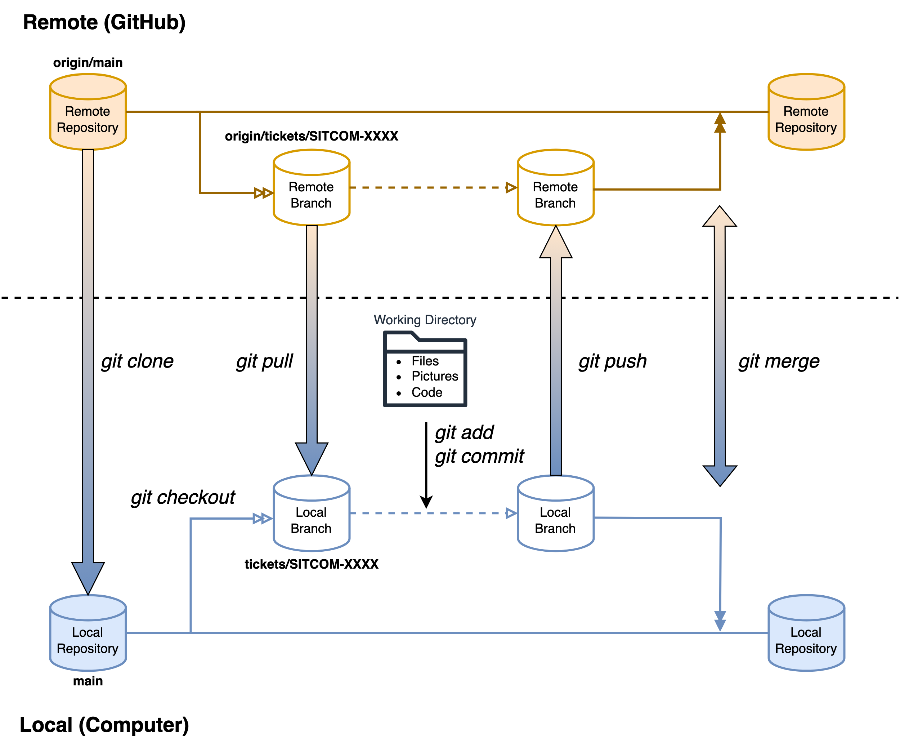
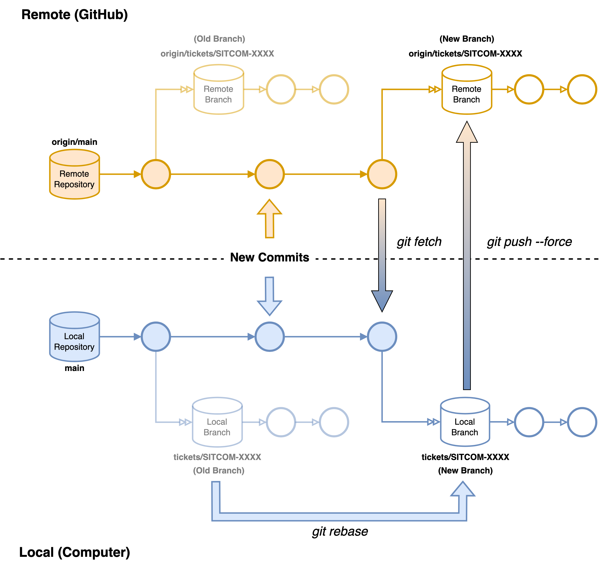

.. This is a template for an informative/general use document. 

.. Review the README in this document's directory on instructions to contribute.
.. Static objects, such as figures, should be stored in the _static directory. Review the _static/README in this procedure's directory on instructions to contribute.
.. Do not remove the comments that describe each section. They are included to provide guidance to contributors.
.. Do not remove other content provided in the templates, such as a section. Instead, comment out the content and include comments to explain the situation. For example:
	- If a section within the template is not needed, comment out the section title and label reference. Include a comment explaining why this is not required.
    - If a file cannot include a title (surrounded by ampersands (#)), comment out the title from the template and include a comment explaining why this is implemented (in addition to applying the ``title`` directive).

.. Include one Primary Author and list of Contributors (comma separated) between the asterisks (*):
.. |author| replace:: *Kris Mortensen*
.. If there are no contributors, write "none" between the asterisks. Do not remove the substitution.
.. |contributors| replace:: *Jacqueline Seron, Lukas Eisert*

.. This is the label that can be used as for cross referencing this procedure.
.. Recommended format is "Directory Name"-"Title Name"  -- Spaces should be replaced by hyphens.
.. _observatory-operations-git-commands:
.. Each section should includes a label for cross referencing to a given area.
.. Recommended format for all labels is "Title Name"-"Section Name" -- Spaces should be replaced by hyphens.
.. To reference a label that isn't associated with an reST object such as a title or figure, you must include the link an explicit title using the syntax :ref:`link text <label-name>`.
.. An error will alert you of identical labels during the build process.

##############################
Git Commands for Documentation
##############################

.. _Git-Comands-Overview:

Overview
========

.. This section should provide a brief, top-level description of the document's purpose and utilization. 

The https://obs-ops.lsst.io/v/ workflow requires many git commands (push, merge, rebase, etc.) to move a document from 
Confluence to Github. This document is designed to provide clarity as to what each git command does with respect
to the documentation workflow. Included here are a list of the most important git commands used when migrating 
documents to obs-ops as well as simple visual representations as to what the common commands with respect with 
respect to an entire git project (working directory, local repository, remote repository, etc.).

.. _Git-Commands-Fig1:

    Fig 1: Visual of the Common Git Workflow for Documentation

.. _Git-Commands-Getting-Started:

Getting Started
===============

Configuring user information, initializing and cloning repositories (:ref:`Fig 1 <Git-Commands-Fig1>`).

.. list-table::
   :header-rows: 1
   :widths: 36 64

   * - Git Command
     - Description
   * - :command:`git init`
     - Initialize an existing directory as a Git repository.
   * - :command:`git remote`
     - See which remote servers you have configured to your working directory.
        
       .. note::
         
        To verify which URL is currently set:

        :command:`git remote -v`

        To set an existing remote repository <name> to a new URL:

        :command:`git remote set-url <name> <url>`  
   * - :command:`git clone <url>`
     - Retrieve an entire repository from a hosted location via URL.  

.. _Git-Commands-Managing-Branches:

Managing Branches
=================

Isolating work in branches, changing context, and integrating changes (:ref:`Fig 1 <Git-Commands-Fig1>`).

.. list-table::
   :header-rows: 1
   :widths: 36 64

   * - Git Command
     - Description
   * - :command:`git branch`
     - Lists your available branches. 

       .. note::
         
        The :math:`*` symbol will appear next to the currently active branch.
   * - :command:`git branch <name>`
     - Creates a new branch at the current commit. 
   * - :command:`git checkout <branch>`
     - Switch to another branch and check it out into your working directory. 

.. _Git-Commands-Staging-Committing:

Staging & Committing
====================

Working with snapshots and the Git staging area (:ref:`Fig 1 <Git-Commands-Fig1>`).

.. list-table::
   :header-rows: 1
   :widths: 36 64

   * - Git Command
     - Description
   * - :command:`git status`
     - Show modified files in working directory, staged for your next commit. 
   * - :command:`git add <file>`
     - Add a file as it looks now to your next commit (stage). 

       .. note::
         
        To add all files at once as staged:

        :command:`git add -A`
   * - :command:`git reset <file>`
     - Un-stage a file while retaining the changes in working directory.  
   * - :command:`git diff`
     - Show differences of what files are changed but not staged.
     
       .. note::
         
        To show differences of what files are staged but not committed:

        :command:`git diff --staged`
   * - :command:`git commit -m “<message>”`
     - Commit your staged content as a new commit snapshot.

       .. warning::
         
        Commit messages should be **short** yet **dense** with information.
   * - :command:`git log`
     - Show all commits in the current branch’s history.    

.. _Git-Commands-Updating-Repositories:

Updating Repositories
=====================

Retrieving updates from another repository and updating local repos (:ref:`Fig 1 <Git-Commands-Fig1>`).

.. list-table::
   :header-rows: 1
   :widths: 36 64

   * - Git Command
     - Description
   * - :command:`git remote show <repo>`
     - Displays information (e.g., remote branches) about the remote repository. 
   * - :command:`git fetch --all`
     - Fetch down all the branches from that Git remote. 
   * - :command:`git merge <branch>`
     - Merge a remote branch into your current branch to bring it up to date.

       .. note::
        To safely bring a branch up to date and preserve history:

        :command:`git merge <branch> --no-ff`
   * - :command:`git push <remote> <branch>`
     - Transmit local <branch> commits to the <remote> repository.
     
       .. note::
         
        First push (sets up remote): 

        :command:`git push --set-upstream <remote> <branch>`

        Consecutive pushes (on branch):

        :command:`git push`

        If a normal push does not update the remote repository, one can safely push with force:

        :command:`git push --force-with-lease`
   * - :command:`git pull <remote>`
     - Fetch and merge any commits from the tracking remote branch to the local branch.

.. _Git-Commands-Fig2:

    Fig 2: Visual of Rebasing Branches in a Git Project

.. _Git-Commands-Amend-History:

Amending History of Branches & Repositories
===========================================

Rewriting branches, updating commits and clearing history (:ref:`Fig 2 <Git-Commands-Fig2>`).

.. list-table::
   :header-rows: 1
   :widths: 36 64

   * - Git Command
     - Description
   * - :command:`git rebase <branch>`
     - Apply any commits of current branch ahead of specified <branch>. 

       .. note::

        | Make sure you are on the branch you want to rebase before applying this command. Typically the commands will be:
        | 1. :command:`git checkout <branch>`
        | 2. :command:`git rebase origin/main`
   * - :command:`git rebase -i <base>`
     - Interactively rebase current branch onto. Launches editor to enter commands
       for how each commit will be transferred to the new base.

       .. note::

        A common <base> to use is :command:`HEAD~n` where n specifies the number of commits to update interactively.
   * - :command:`git reset --hard <commit>`
     - Clear staging area, rewrite working tree from specified commit.
       
       .. warning::

        This command is useful if branches accidentally merged incorrectly and the local repository needs 
        to be reset. Keep in mind that **this will undo any previous work in the repository**.